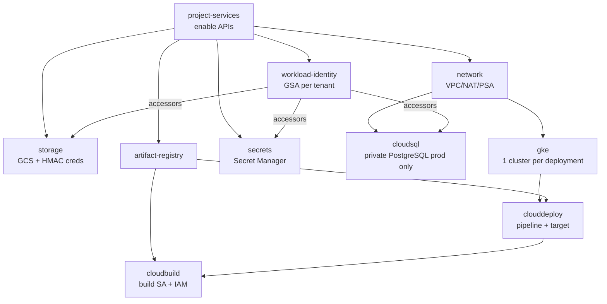

# yourown-chat-stack

Production-grade, cloud-agnostic-where-practical GCP platform, managed with
**HCP Terraform + Terraform Stacks** and validated in **GitLab CI**.

This repository currently implements the **first platform slice**, split into
two isolated Stacks **deployments** (`dev` + `prod`), each with its own zonal
GKE cluster and data plane inside a single GCP project:

| Capability | Implementation |
|------------|----------------|
| PostgreSQL database (Germany) | Cloud SQL for PostgreSQL, private IP, `europe-west3`, PITR + 7-day backups |
| Object storage ("S3") | Cloud Storage bucket, `EUROPE-WEST3` (+ S3-compatible HMAC creds for Mattermost) |
| Kubernetes | Per environment: a **zonal** GKE Standard cluster, private nodes (prod 1× `e2-standard-2` on-demand; dev 1× `e2-medium` Spot) |
| Container registry | Artifact Registry (Docker) — the supported replacement for GCR |
| CI build | Cloud Build (least-privilege SA) |
| CD to GKE | Cloud Deploy delivery pipeline + GKE target |
| Secrets | **Every** credential in **Secret Manager**, mounted via the GKE Secret Manager CSI add-on + Workload Identity |
| Apps | prod cluster: Mattermost (operator CR + managed Cloud SQL); dev cluster: dev Mattermost + matterbridge + in-cluster Postgres |

> There is no "S3" on GCP — the equivalent is a **Cloud Storage (GCS) bucket**,
> which is what this stack provisions in the same German region.

---

## Architecture rationale & tradeoffs

The brief asks for a **production-grade** platform *and* the **cheapest** GKE.
Environments are modeled the idiomatic Stacks way — **one deployment per
environment** (`dev` + `prod`), each fully isolated with its own GKE cluster,
VPC and data plane. This gives physical prod/dev isolation and an independent
lifecycle, at the cost of a second cluster.

**Cost tradeoff (accepted):** GKE's free tier waives the management fee for only
**one** zonal cluster per billing account, so the second cluster adds ~$74/mo.
dev is minimized to claw that back — a single **Spot** node and **in-cluster
Postgres** (no managed Cloud SQL).

| Line item | Config | ~$/mo |
|-----------|--------|-------|
| prod GKE control plane | 1 zonal cluster | $0 (free tier) |
| prod node | 1× `e2-standard-2`, on-demand | ~$49 |
| prod Cloud SQL | `db-f1-micro`, 20Gi SSD, PITR + 7-day backups | ~$12–15 |
| prod GCS (filestore) | Standard, small | ~$2 |
| **dev GKE control plane** | 2nd zonal cluster (no free tier) | **~$74** |
| dev node | 1× `e2-medium` **Spot** | ~$8 |
| dev storage (Spot PD + in-cluster pg PVC) | pd-standard | ~$1 |
| Buffer (egress/growth) | | ~$10 |
| **Total** | | **~$140–150** |

> This is above the earlier ~$90 single-cluster figure. If the $100 ceiling is
> firm, collapse back to one cluster with two node pools (git history has the
> single-`platform`-deployment topology) — that design already isolated dev from
> prod via a tainted prod pool.

Every cost/HA knob is a typed variable with a production-safe path:

| Concern | Default | Harden (flip a variable) |
|---------|---------|--------------------------|
| GKE control plane | Zonal (free-tier eligible) | `gke_regional = true` |
| prod nodes | 1× `e2-standard-2`, on-demand | bump `max_count` / machine type |
| prod Cloud SQL | `db-f1-micro`, `ZONAL`, PITR on | `db-custom-*`, `REGIONAL` (HA) |
| dev database | in-cluster Postgres (`cloudsql_enabled=false`) | `cloudsql_enabled = true` |
| Environments | `dev` + `prod` deployments | add a `stage` deployment |
| Control-plane access | `master_authorized_networks` (CI CIDR) | keep restricted |

Non-negotiable production practices are kept **even at this budget**: private
nodes + Cloud NAT egress, Workload Identity, Shielded Nodes, private-IP Cloud SQL
over Private Service Access, uniform bucket access + public-access prevention,
dedicated least-privilege service accounts, **all secrets in Secret Manager**,
and encryption on by default (CMEK-ready).

**Environment isolation:** dev and prod are separate clusters, so dev load can
never contend with prod. Each cluster runs a single untainted node pool labelled
`tier=prod` / `tier=dev` respectively, matching the `nodeSelector` on the GitOps
manifests. The pool is deliberately **not** tainted: a lone tainted pool would
leave kube-system / CoreDNS unschedulable.

**GKE Standard vs Autopilot:** Standard is chosen because the target
architecture calls for explicit multiple node pools and node-level cost control
(machine type, disk, taints) that Autopilot abstracts away.

## Dependency graph



Ordering is expressed by components referencing each other's outputs — explicit
dependencies, no implicit ordering. Workload Identity SA emails flow into the
secret-owning components as least-privilege `secretAccessor` members.

## Repository layout

```
.terraform-version        # Terraform Core version pin (read by HCP Stacks + CI)
.terraform.lock.hcl       # provider lock (committed at the stack root; HCP reads it)
providers.tfcomponent.hcl # stack provider requirements + configuration
variables.tfcomponent.hcl # typed stack input variables
components.tfcomponent.hcl # component wiring (one block per platform building block)
outputs.tfcomponent.hcl   # stack outputs
deployments.tfdeploy.hcl  # dev + prod deployments (one cluster each)
infra/
  modules/                # small, single-purpose, reusable modules
    project-services/     # API enablement (dependency root)
    network/              # VPC, subnet(+secondary ranges), Router, NAT, PSA
    gke/                  # zonal Standard cluster + node_pools map + WI + CSI
    cloudsql/             # private PostgreSQL + DB + user + password/conn secrets
    storage/              # GCS bucket (+ optional Mattermost S3 HMAC creds)
    artifact-registry/    # Docker repo
    cloudbuild/           # build identity + least-privilege IAM
    clouddeploy/          # delivery pipeline + GKE target + execution SA
    secrets/              # Secret Manager map (generate/provide + accessors)
    workload-identity/    # per-tenant GSA bound to a KSA (WI)
  environments/           # per-env docs (env == Stacks deployment)
platform/                 # GitOps manifests (separate from infra + app)
  namespaces.yaml
  mattermost/             # prod: SA + SecretProviderClass + secret-sync + CR
  matterbridge/           # SA + SecretProviderClass + Deployment (dev cluster)
  dev/                    # SA/SPC + in-cluster Postgres + dev Mattermost
app/                      # sample workload + CI/CD manifests
  Dockerfile, index.html
  k8s/                    # deployment.yaml, service.yaml
  skaffold.yaml           # consumed by Cloud Deploy
  cloudbuild.yaml         # build -> push -> create release
.gitlab-ci.yml            # module fmt/validate + manifest lint
```

> Stack layout: the Terraform Stacks configuration lives at the **repository
> root**, using the `*.tfcomponent.hcl` (components, providers, variables,
> outputs) and `*.tfdeploy.hcl` (deployments) file suffixes that current
> Terraform Stacks requires. Root placement is deliberate: HCP Terraform reads
> the stack from the root of the connected repository, and it is what pulls the
> local `infra/modules/` into the stack source bundle (a nested stack dir would
> exclude them). A committed `.terraform.lock.hcl` pins provider versions and
> hashes for reproducible runs.

> Version pin: HCP Terraform Stacks selects the Terraform Core version from the
> repo-root **`.terraform-version`** file (currently `1.15.8`). The GitLab CI
> images are pinned to the same version so local, CI, and HCP runs agree.

> Separation of concerns: **infra** (Terraform) provisions cloud resources,
> **platform/** (GitOps) runs the chat workloads, and **app/** is a sample
> deployed by Cloud Deploy — stateful, platform, and stateless are kept apart.

## Deploying (HCP Terraform Stacks)

1. Create **one** GCP project with billing linked, or reuse an existing one.
   This slice does **not** create projects/org (that is a separate future
   foundation stack requiring org + billing permissions).
2. In `deployments.tfdeploy.hcl` (repo root) the project ID (`yourown-chat`),
   WIF `audience` and apply-SA are already wired; set the real
   `master_authorized_networks` CIDR (still `REPLACE-ME/32`) — both deployments
   share it via a `local`.
3. Configure **keyless** GCP auth in HCP Terraform (no credentials are ever
   committed). The Workload Identity Federation pool/provider and least-privilege
   `terraform plan`/`apply` service accounts are documented in
   [`google_cloud_init.md`](google_cloud_init.md) and
   [`docs/BOOTSTRAP.md`](docs/BOOTSTRAP.md); the `audience` and
   `service_account_email` inputs are already wired to that setup. HCP mints the
   OIDC token via the `identity_token` block (its `aud` matches the provider's
   allowed-audiences); the google provider exchanges it through WIF
   (`external_credentials`) and impersonates the apply SA.
4. Create the Stack in HCP Terraform pointing at the repository **root**, then
   plan and apply the `prod` and `dev` deployments.
5. Deploy the chat workloads from [`platform/`](platform/README.md): install the
   ingress-nginx controller + Mattermost operator, replace the `REPLACE-ME-*`
   markers (project ID, bucket, Workload Identity SA emails from
   `terraform output workload_identity_emails`), then apply the manifests.

## CI/CD flow

```
GitLab push ──► Cloud Build (build image ─► push to Artifact Registry)
                     └─► gcloud deploy releases create
                             └─► Cloud Deploy delivery pipeline ─► GKE target
```

- `app/cloudbuild.yaml` runs as the Terraform-provisioned Cloud Build SA
  (repo-scoped AR writer + `clouddeploy.releaser` + `actAs` the Cloud Deploy
  execution SA).
- Connecting Cloud Build to **GitLab** requires a Cloud Build 2nd-gen
  connection backed by a GitLab PAT in Secret Manager — a one-time manual/
  scripted step, intentionally left out of Terraform (keeps the secret out of
  code). See open questions.

## Security considerations

- Least-privilege, per-purpose service accounts (node, build, deploy, per-tenant
  Workload Identity); the default compute SA is never used.
- Private GKE nodes; egress only via Cloud NAT; Workload Identity for every pod
  that touches GCP.
- Cloud SQL private IP only (`ipv4_enabled = false`), `ENCRYPTED_ONLY` TLS.
- **All secrets in Secret Manager** — DB password + connection URI (cloudsql),
  GCS S3-compatible HMAC keys (storage), dev Postgres password + matterbridge
  config (secrets module). None are surfaced as plaintext outputs; pods read
  them via the GKE Secret Manager CSI add-on, gated by per-tenant `secretAccessor`
  IAM (a workload can read only its own secrets).
- Buckets: uniform bucket-level access + public access prevention enforced.
- **Flagged:** set `master_authorized_networks` to your CI/office CIDRs before
  real use (the deployment ships a `REPLACE-ME/32` placeholder).

## Future scalability

Modules are intentionally small so the rest of the platform vision (Vault,
Authentik, ingress-nginx, cert-manager, ExternalDNS, Prometheus/Grafana/Loki)
slots in as **new components** in the same Stack, and additional
regions/environments as **new deployments** — no root-module rewrites. Mattermost
and matterbridge already run as GitOps workloads in [`platform/`](platform/).
The network module is already hub-and-spoke-ready and provisions PSA for future
private managed services. A `stage` environment is one more `deployment` block;
hardening prod is flipping `gke_regional` / `cloudsql_availability_type`, and dev
gains a managed database via `cloudsql_enabled = true`.

## Decisions made autonomously — please review

These were resolved without you (you were unavailable) and are easy to change:

1. **Region:** `europe-west3` (Frankfurt) over `europe-west10` (Berlin) —
   cheaper and more mature. One-variable change.
2. **Topology:** `dev` + `prod` as separate Stacks deployments, each its own
   zonal cluster (per your request). This exceeds the earlier ~$100/mo ceiling by
   ~$50 (second-cluster fee); dev is minimized (Spot node + in-cluster Postgres)
   to limit it. Revert to one cluster if the ceiling is firm.
3. **Scope:** provisions into an **existing** `project_id`; org/project
   bootstrap deferred to a foundation stack.
4. **Cloud SQL:** prod only — `db-f1-micro` + PITR + 7-day backups, no HA (HA
   alone would consume most of the budget). dev uses in-cluster Postgres
   (`cloudsql_enabled = false`).
5. **Apps:** prod Mattermost via the operator CR (external Cloud SQL + GCS
   filestore); dev Mattermost + matterbridge as lightweight Deployments. Confirm
   the Mattermost operator version, ingress host, and matterbridge bridges.
6. **GitLab ↔ Cloud Build** connection details (host, PAT) still needed to
   create triggers in Terraform.
7. **Auth model:** keyless OIDC -> WIF is wired (`external_credentials`) with the
   real `audience` and apply-SA (`terraform-apply@yourown-chat`) from
   `google_cloud_init.md`; the `identity_token` `aud` matches the provider's
   allowed-audiences. Only the control-plane CIDR remains a placeholder.
