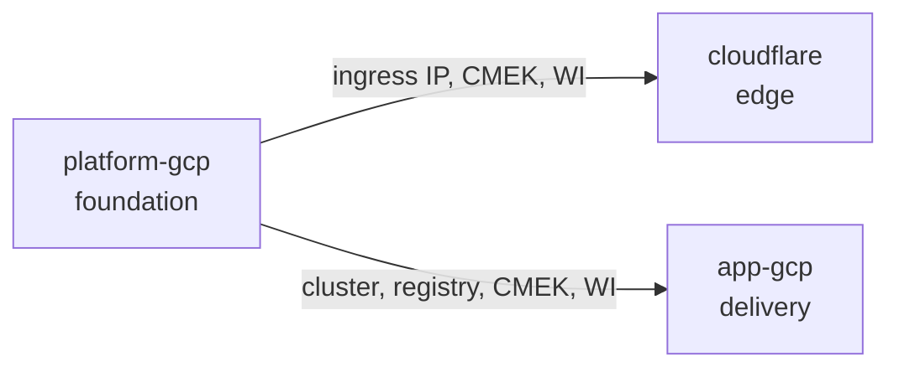
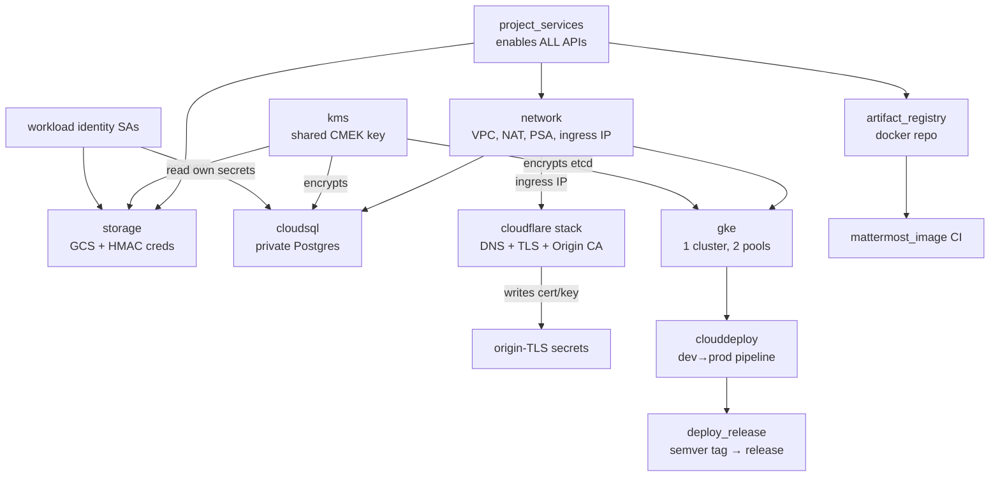

# YourOwn.Chat

A self-hosted Mattermost chat platform on Google Cloud, fronted by Cloudflare,
managed end-to-end with **HCP Terraform Stacks** — production practices on a
~$100/month budget.

**[Русская версия → README.ru.md](README.ru.md)**

---

## What's inside

Everything lives in one GCP project and is described by **three linked
Terraform Stacks**, each owning a piece with its own state and blast radius:

| Stack | Directory | What it owns | Changes |
|---|---|---|---|
| **platform-gcp** | `terraform/platform-gcp` | The stateful foundation: APIs, network + reserved ingress IP, CMEK key, GKE cluster, Cloud SQL, object storage, container registry, Workload Identity SAs | Rarely |
| **cloudflare** | `terraform/cloudflare` | The public edge for `yourown.chat`: DNS, TLS/security settings, DNSSEC, WAF, Origin CA cert + the origin-TLS secrets it fills | Sometimes |
| **app-gcp** | `terraform/app-gcp` | The delivery machinery: app secrets, Cloud Deploy pipeline, image CI, tag-triggered release cutting, cluster bootstrap (Mattermost Operator + ingress-nginx as Helm releases) | Often |

The platform stack **publishes** its key values (ingress IP, cluster ID,
registry coordinates, CMEK key, Workload Identity members); the other two
**consume** them over HCP's linked-stacks mechanism. Nothing is copy-pasted
between stacks, and when a platform apply changes a published value, HCP
automatically triggers the downstream plans:



Why split? A mistake in edge rules or CI can now never touch the state that
holds the VPC, the cluster and the database — and the Cloudflare API token
(the only static secret in the whole setup) lives alone in its own stack.

### Capabilities at a glance

| Capability | How |
|---|---|
| PostgreSQL | Cloud SQL, private IP only, Frankfurt (`europe-west3`), PITR + 7-day backups |
| Object storage | GCS bucket with S3-compatible HMAC creds for Mattermost ("filestore") |
| Kubernetes | One zonal GKE Standard cluster, private nodes, two pools: tainted prod (`e2-standard-2`) + dev/system (`e2-medium`) |
| Container registry | One Artifact Registry repo (`docker`), optional vulnerability scanning |
| CI | Cloud Build builds the Mattermost image on a `v*-patched` git tag |
| CD | Cloud Deploy dev → prod pipeline; a semver tag on this repo cuts a release automatically |
| Secrets | Everything in Secret Manager, mounted via the CSI add-on + Workload Identity |
| Encryption | One shared Cloud KMS **HSM** key (CMEK, 90-day rotation) over Cloud SQL, GCS, Secret Manager and **GKE etcd** (application-layer Kubernetes Secrets encryption) |
| Edge | Cloudflare proxy: Full (Strict) TLS, DNSSEC, HSTS, www→apex redirect, Origin CA cert issued by Terraform |

> GCP has no "S3" — its equivalent is a Cloud Storage (GCS) bucket, which is
> what this platform provisions, in the same German region.

---

## How the pieces fit



The flow in plain words:

1. **platform-gcp** builds the foundation and reserves a static public IP.
2. **cloudflare** points `yourown.chat` at that IP (proxied), hardens the edge,
   issues an Origin CA certificate and writes it straight into Secret Manager.
   The private key never leaves this stack — linked stacks can't publish
   sensitive values, so the secrets are created where the cert is born.
3. **app-gcp** wires up delivery: Cloud Build watches
   `pilprod/mattermost` for image tags, Cloud Deploy delivers the `helm/`
   workloads dev → prod, and a semver tag on **this** repo cuts a release
   without any human running a command. It also bootstraps the cluster
   itself — the Mattermost Operator and the Cloudflare-locked ingress-nginx
   edge install as Terraform-managed Helm releases (the helm provider talks
   to the GKE endpoint with a short-lived token for the same keyless apply
   SA; `loadBalancerIP` arrives from the platform's published ingress IP).
4. Kubernetes workloads (`helm/`) mount their credentials from Secret Manager
   at runtime — pods read secrets directly, no matter which stack wrote them.

---

## Repository layout

```
terraform/
  platform-gcp/          # stack 1: foundation (network, GKE, SQL, storage, KMS, registry, WI)
  cloudflare/            # stack 2: edge (DNS/TLS/WAF/Origin CA) + origin-TLS secrets
  app-gcp/               # stack 3: delivery (secrets, Cloud Deploy, image CI, release cutting,
                         #   cluster bootstrap: operator + ingress-nginx Helm releases)
                         # each stack: *.tfcomponent.hcl + *.tfdeploy.hcl + modules/ + its own lock file
helm/                    # Kubernetes workloads, delivered by Cloud Deploy
  skaffold.yaml          # dev/prod render profiles
  mattermost/            # prod Mattermost (operator CR + SecretProviderClass)
  matterbridge/          # isolated bridge deployment
  developing/            # shared dev namespace: Mattermost, Postgres, RBAC, NetworkPolicies
  ingress-nginx/         # Cloudflare-only ingress values + runbook
docs/BUILD.md            # image build flow in detail
```

A few structural notes worth knowing:

- **One stack per directory.** HCP Terraform reads one stack per working
  directory, so there are three HCP Stacks pointing at the three directories.
- **Modules are not shared across stacks.** The Stacks bundler can't follow
  `../` paths, so each stack carries its own `modules/` (the small `secrets`
  module exists twice on purpose).
- **Each stack pins its own providers** (`.terraform.lock.hcl`) and Terraform
  version (`.terraform-version`, currently 1.15.8).

### Naming convention

Resources are named by their **actual footprint and function** — never by
project (it's already `yourown-chat`) and never by resource type:

| Scope | Rule | Examples |
|---|---|---|
| Global singletons | bare role | `vpc`, `cmek`, `psa`, `allow-internal` |
| Regional singletons | region | subnet/router/NAT = `europe-west3` |
| Zonal resources | zone | GKE cluster `europe-west3-b` |
| Workload-owned | function prefix | `mattermost-europe-west3-b` (SQL), `mattermost-europe-west3` (bucket), `mattermost-storage` (HMAC SA) |
| Platform utilities | role, then scope | `releaser-europe-west3`, `clouddeploy-europe-west3`, `deploy-source-europe-west3`, `ingress-europe-west3` |
| Role SAs | role | `mattermost`, `matterbridge` |

---

## Setting it up

The one manual phase is the bootstrap below; after it, everything is
`terraform apply`. The full step-by-step with expected outputs lives in
**[Google Cloud Initial Setup](#google-cloud-initial-setup)** — this is the
short version:

1. **Bootstrap GCP** (once): enable six bootstrap APIs, create the Workload
   Identity pool/provider for HCP Terraform, create the `terraform-plan` /
   `terraform-apply` service accounts and grant roles. No keys are created —
   auth is keyless OIDC end to end.
2. **Authorize the Cloud Build GitHub connection** (once, in the console):
   one OAuth connection named `pilprod-github` covering both
   `pilprod/mattermost` and `pilprod/yourown-chat`.
3. **Create the Cloudflare API token** (zone-scoped, the only static secret)
   and store it in an HCP variable set attached to the cloudflare stack.
4. **Create the three HCP Stacks** — names must be exactly `platform-gcp`,
   `cloudflare`, `app-gcp` (the linked-stack sources reference them), working
   directories `terraform/<stack>`.
5. **Apply**: platform-gcp first; cloudflare and app-gcp follow automatically
   (they only depend on the platform, so their order doesn't matter).
6. **Deploy the workloads** from [`helm/`](docs/DEPLOY.md): ingress-nginx +
   Mattermost operator, apply manifests. The bucket and Workload Identity
   emails are injected automatically via Cloud Deploy deploy parameters; only
   the ingress `loadBalancerIP` and the dev-team RBAC principal stay manual.

### Day-2 flows

**Ship a new Mattermost image** — tag the source repo; the same artifact is
promoted, never rebuilt:

```
git tag v9.11.3-patched  (on pilprod/mattermost)
  → Cloud Build builds & pushes docker/mattermost:v9.11.3-patched
```

**Cut a release** — tag this repo; no human runs gcloud:

```
git tag 1.2.3  (on pilprod/yourown-chat)
  → Cloud Build trigger "release" runs gcloud deploy releases create
  → dev target deploys + smoke-test verify
  → prod promotion waits for approval
```

**Rotate the DB password** — bump one committed value, no time-based
surprises:

```
edit terraform/platform-gcp/platform.tfdeploy.hcl:
  cloudsql_password_rotation = "2026-07-13"   # any new value
merge + apply  → new password, SQL user + both secrets updated together
kubectl rollout restart -n mattermost deploy  → pods pick up the new secret
```

Details: [`docs/BUILD.md`](docs/BUILD.md).

---

## Design decisions & tradeoffs

### One cluster, ~$100/month

The brief asks for production practices **and** the cheapest practical GKE
footprint around a ~$100/month target. GKE's free tier waives the management fee
for exactly one zonal cluster — a second cluster would add ~$74/month. So dev
and prod share **one cluster** and are isolated in-cluster instead of physically:

- prod runs on a dedicated **tainted** pool (`e2-standard-2`) — dev workloads
  can't schedule there, so they can never contend for prod's CPU or memory;
- dev shares an untainted `e2-medium` system pool with `kube-system` —
  on-demand, not Spot, because preempting CoreDNS would hurt prod too; it idles
  at one node and may autoscale to three when system pods need headroom;
- development services and databases share the `dev` namespace, which is
  locked down with namespace-scoped RBAC and default-deny NetworkPolicies;
  integration workloads such as Matterbridge remain isolated in their own
  namespaces.

| Line item | Config | ≈$/mo |
|---|---|---|
| GKE control plane | 1 zonal cluster | $0 (free tier) |
| prod nodes | 1× `e2-standard-2` | ≈$49 |
| dev/system nodes | 1× `e2-medium` | ≈$24 |
| Cloud SQL | `db-f1-micro`, 20 GiB, PITR | ≈$12–15 |
| GCS + PVCs | small | ≈$3 |
| Buffer | egress/growth | ≈$10–15 |
| **Total** | | **≈$98–106** |

Every knob has a hardening path — flip a variable, don't re-architect:
`gke_regional = true` for an HA control plane, `REGIONAL` for HA Cloud SQL,
a separate deployment for a hard dev/prod split.

### What stays non-negotiable even at this budget

Private nodes + Cloud NAT, Workload Identity everywhere, Shielded Nodes,
private-IP-only Cloud SQL with forced TLS, uniform bucket access + public
access prevention, per-purpose least-privilege service accounts, all secrets
in Secret Manager, and CMEK (HSM, FIPS 140-2 L3) on by default.

### Choices you might question

1. **Frankfurt (`europe-west3`) over Berlin** — cheaper and more mature.
   One-variable change.
2. **GKE Standard over Autopilot** — the design needs explicit node pools,
   taints and machine-type control that Autopilot abstracts away.
3. **The registry lives in platform-gcp, not app-gcp** — it's a stateful store
   of released images; losing it would orphan every promoted tag. The CI
   reaches it over the stack link, so no dependency cycle.
4. **HSM CMEK (~$1/mo) over SOFTWARE (~$0.06/mo)** — Cloud SQL binds its key
   at creation, so choosing HSM up front avoids a later instance migration.
5. **Existing project only** — org/folder/project bootstrap is deferred to a
   future foundation stack.
6. **Console OAuth for the Cloud Build connection, not a PAT** — the PAT path
   is brittle (the token must itself see the GitHub App installation); the
   one-time console authorization is the reliable, Google-blessed path.

### Hard-won lessons encoded in this repo

These cost real debugging time; the configuration now guards against them:

- **Linked stacks can't publish sensitive values** — that's why the origin-TLS
  secrets are created in the cloudflare stack rather than passed to app-gcp.
- **Varsets carry secrets only.** Every `store` value in Stacks is ephemeral:
  perfect for the Cloudflare token, rejected for anything that must persist
  into the plan. Operational toggles are committed literals in
  `*.tfdeploy.hcl`.
- **Cloud KMS objects are undeletable** — re-bootstrapping an existing project
  needs `kms_adopt_existing = true` (a config-driven import, no-op afterwards).
- **Cloud SQL reserves a deleted instance name for ~a week** — hence the
  `cloudsql_adopt_existing_instance` escape hatch and zonal-aware naming.
- **Cloudflare normalizes `tls_1_3` to `zrt` while 0-RTT is on** — sending
  `"on"` creates a perpetual plan diff. The config says `zrt`.
- **Don't IP-allowlist the Cloudflare token on HCP-managed runs** — plan/apply
  egress IPs are dynamic and not in HCP's published ranges.

---

## Security model

- **Identity**: keyless OIDC → Workload Identity Federation for Terraform;
  Workload Identity for every pod; per-purpose SAs; the default compute SA is
  never used.
- **Network**: private nodes, egress via Cloud NAT only, private-IP Cloud SQL
  over Private Service Access, ingress-nginx admits only Cloudflare ranges.
- **Secrets**: all in Secret Manager, CMEK-encrypted replicas, read at runtime
  via the CSI add-on, gated per-tenant (`secretAccessor` on exactly the
  secrets each workload owns).
- **Edge**: Full (Strict) TLS with a Terraform-issued Origin CA cert, DNSSEC,
  HSTS with preload, optional Authenticated Origin Pulls (mTLS).
- **Dev environment**: one namespace for services and databases, namespace
  RBAC (no cluster rights), default-deny cross-namespace traffic, and
  `automountServiceAccountToken: false`.

## Growing it later

Modules are deliberately small: Vault, Authentik, cert-manager, ExternalDNS or
a monitoring stack slot in as new components, new services as Workload
Identity tenants, extra images as one more entry in the `builds` map. A budget
raise turns into a hard dev/prod split (one more deployment or a second
cluster) without rewrites.

---

## Google Cloud Initial Setup

One-time, out-of-band bootstrap that the Terraform stacks depend on. Run it
once; afterwards the three stacks provision everything else themselves.

What this section does:

- enables the **bootstrap** APIs (auth + Service Usage + Secret Manager) so
  Terraform can enable the rest itself;
- creates the Workload Identity Pool and OIDC Provider;
- creates the `plan` / `apply` service accounts, impersonation bindings and
  project IAM roles;
- authorizes the shared Cloud Build GitHub connection (`pilprod-github`);
- creates the Cloudflare API token (the only static secret — Cloudflare has no
  Workload Identity path);
- creates the three linked Stacks in HCP Terraform.

### Auth flow

```
HCP Terraform run
   -> mints OIDC JWT   (identity_token "gcp", aud = full WIF provider URL)
   -> WIF provider     (issuer app.terraform.io, verifies org + project)
   -> STS token exchange
   -> impersonates the least-privilege apply SA
   -> short-lived access token
   -> google provider (external_credentials) -> Google Cloud APIs
```

The Terraform side is already wired: the `identity_token "gcp"` blocks and
deployments in `platform.tfdeploy.hcl` / `app.tfdeploy.hcl` /
`cloudflare.tfdeploy.hcl` carry the real `audience` and
`service_account_email` — no placeholders to fill.

### Input values

| Variable | Value |
| --- | --- |
| `PROJECT_ID` | `yourown-chat` |
| `TFC_ORG` | `papou-work` |
| `TFC_PROJECT` | `yourown-chat` |
| `WIF_POOL_ID` | `hcp-terraform` |
| `WIF_PROVIDER_ID` | `hcp-terraform` |
| `PLAN_SA` | `terraform-plan` |
| `APPLY_SA` | `terraform-apply` |

### 1. Initialize environment

```sh
export PROJECT_ID="yourown-chat"
export PROJECT_NUMBER="$(gcloud projects describe "$PROJECT_ID" --format='value(projectNumber)')"

export TFC_ORG="papou-work"
export TFC_PROJECT="yourown-chat"

export WIF_POOL_ID="hcp-terraform"
export WIF_PROVIDER_ID="hcp-terraform"

export PLAN_SA="terraform-plan"
export APPLY_SA="terraform-apply"
```

### 2. Enable the bootstrap APIs

Only the APIs Terraform needs *before* it can authenticate, plus Secret
Manager. Every other API is enabled by the platform stack's
`project_services` component — this list is the single source of truth for
manual enablement.

```sh
gcloud services enable \
  cloudresourcemanager.googleapis.com \
  serviceusage.googleapis.com \
  iam.googleapis.com \
  iamcredentials.googleapis.com \
  sts.googleapis.com \
  secretmanager.googleapis.com \
  --project="$PROJECT_ID"
```

### 3. Create the Workload Identity Pool

```sh
gcloud iam workload-identity-pools create "$WIF_POOL_ID" \
  --project="$PROJECT_ID" \
  --location="global" \
  --display-name="HCP Terraform"
```

### 4. Create the OIDC Provider for HCP Terraform

```sh
gcloud iam workload-identity-pools providers create-oidc "$WIF_PROVIDER_ID" \
  --project="$PROJECT_ID" \
  --location="global" \
  --workload-identity-pool="$WIF_POOL_ID" \
  --display-name="HCP Terraform OIDC" \
  --issuer-uri="https://app.terraform.io" \
  --allowed-audiences="https://iam.googleapis.com/projects/$PROJECT_NUMBER/locations/global/workloadIdentityPools/$WIF_POOL_ID/providers/$WIF_PROVIDER_ID" \
  --attribute-mapping="google.subject=assertion.sub,attribute.terraform_organization_name=assertion.terraform_organization_name,attribute.terraform_project_name=assertion.terraform_project_name,attribute.terraform_stack_name=assertion.terraform_stack_name,attribute.terraform_run_phase=assertion.terraform_run_phase" \
  --attribute-condition="assertion.terraform_organization_name=='papou-work' && assertion.terraform_project_name=='yourown-chat'"
```

### 5. Create the service accounts

```sh
gcloud iam service-accounts create "$PLAN_SA" \
  --project="$PROJECT_ID" \
  --display-name="HCP Terraform Plan"

gcloud iam service-accounts create "$APPLY_SA" \
  --project="$PROJECT_ID" \
  --display-name="HCP Terraform Apply"
```

### 6. Allow HCP Terraform impersonation

```sh
export WIF_PRINCIPAL_SET="principalSet://iam.googleapis.com/projects/$PROJECT_NUMBER/locations/global/workloadIdentityPools/$WIF_POOL_ID/attribute.terraform_organization_name/$TFC_ORG"

gcloud iam service-accounts add-iam-policy-binding \
  "$PLAN_SA@$PROJECT_ID.iam.gserviceaccount.com" \
  --project="$PROJECT_ID" \
  --role="roles/iam.workloadIdentityUser" \
  --member="$WIF_PRINCIPAL_SET"

gcloud iam service-accounts add-iam-policy-binding \
  "$APPLY_SA@$PROJECT_ID.iam.gserviceaccount.com" \
  --project="$PROJECT_ID" \
  --role="roles/iam.workloadIdentityUser" \
  --member="$WIF_PRINCIPAL_SET"
```

### 7. Grant project IAM roles

Plan SA — read-only:

```sh
gcloud projects add-iam-policy-binding "$PROJECT_ID" \
  --member="serviceAccount:$PLAN_SA@$PROJECT_ID.iam.gserviceaccount.com" \
  --role="roles/viewer"

gcloud projects add-iam-policy-binding "$PROJECT_ID" \
  --member="serviceAccount:$PLAN_SA@$PROJECT_ID.iam.gserviceaccount.com" \
  --role="roles/browser"
```

Apply SA — everything the stacks create (single source of truth):

```sh
export APPLY="serviceAccount:$APPLY_SA@$PROJECT_ID.iam.gserviceaccount.com"

for ROLE in \
  roles/serviceusage.serviceUsageAdmin \
  roles/resourcemanager.projectIamAdmin \
  roles/iam.serviceAccountAdmin \
  roles/iam.serviceAccountUser \
  roles/secretmanager.admin \
  roles/container.admin \
  roles/compute.networkAdmin \
  roles/compute.securityAdmin \
  roles/cloudkms.admin \
  roles/cloudsql.admin \
  roles/storage.admin \
  roles/clouddeploy.admin \
  roles/artifactregistry.admin \
  roles/cloudbuild.connectionAdmin \
  roles/cloudbuild.builds.editor ; do
  gcloud projects add-iam-policy-binding "$PROJECT_ID" \
    --member="$APPLY" --role="$ROLE" --condition=None
done
```

Why each role, in one line each:

| Role | Grants |
|---|---|
| `serviceusage.serviceUsageAdmin` | the stack enables its own APIs |
| `resourcemanager.projectIamAdmin` | project-level IAM bindings (node SA reader, build SA log writer…) |
| `iam.serviceAccountAdmin` + `serviceAccountUser` | create the per-tenant/build SAs and `actAs` them |
| `secretmanager.admin` | create secrets + grant tenants `secretAccessor` |
| `container.admin` | GKE cluster + node pools |
| `compute.networkAdmin` + `securityAdmin` | VPC/NAT/PSA/IP + firewall rules (create/update lives in `securityAdmin`) |
| `cloudkms.admin` | CMEK key ring/key + service-agent grants |
| `cloudsql.admin` | private Postgres instance + DB + user |
| `storage.admin` | GCS bucket + HMAC keys |
| `clouddeploy.admin` | pipeline + targets + execution SA binding |
| `artifactregistry.admin` | the `docker` repo + build SA writer grant |
| `cloudbuild.connectionAdmin` + `builds.editor` | repository links + tag triggers on the shared connection |

> Start broad to keep the first apply unblocked without granting Owner/Editor;
> tighten later with resource-scoped conditions once names stabilize.

Verify:

```sh
gcloud projects get-iam-policy "$PROJECT_ID" \
  --flatten="bindings[].members" \
  --filter="bindings.members:terraform-plan OR bindings.members:terraform-apply" \
  --format="table(bindings.role, bindings.members)"
```

### 8. Create the Cloud Build GitHub connection

Two repos feed CI/CD: `pilprod/mattermost` (image source) and
`pilprod/yourown-chat` (this repo, holds `helm/`). Both link to **one** shared
2nd-gen connection you authorize **once in the console** — Terraform then
attaches the repository links and triggers to it, but never owns the
connection itself.

> **Why console OAuth, not a PAT?** The PAT path is brittle: the token must
> itself have access to the GitHub App installation, or Cloud Build rejects it
> ("the user token does not have access to installations"). The console's
> *Authorize* button runs the OAuth flow and stores the token for you — the
> reliable, Google-blessed path. No PAT, no Secret Manager secret, no
> installation-ID variable.

1. Console → **Cloud Build → Repositories (2nd gen) → Create host connection**;
   GitHub, region `europe-west3` (must match the stack region).
2. Name it **`pilprod-github`**, click **Authorize**, grant the *Google Cloud
   Build* GitHub App access to **both** repos.
3. Skip the optional CMEK encryption prompt; click **Connect**.

Don't link the repositories by hand — Terraform does that on apply. The
connection name is a stack input (`github_connection_name`, default
`pilprod-github`).

To rotate or re-scope access later, re-authorize the App from the console or
GitHub settings — the connection keeps its name and ID, so Terraform doesn't
change. If you ever recreate it, reuse the same name.

### 9. Create the three linked Stacks in HCP Terraform

All three live in the **same HCP project** (linked stacks only work
project-locally) and connect to this repo — only the working directory
differs. Names must match the `upstream_input` sources **exactly**
(`app.terraform.io/papou-work/yourown-chat/<stack name>`):

| Stack name | Working directory | Consumes |
|---|---|---|
| `platform-gcp` | `terraform/platform-gcp` | — |
| `cloudflare` | `terraform/cloudflare` | `platform-gcp` |
| `app-gcp` | `terraform/app-gcp` | `platform-gcp` (not cloudflare) |

Then:

1. Attach the Cloudflare variable set (step 10) to the **cloudflare** stack.
2. Plan + apply **platform-gcp** first. The first plan proves federation end to
   end — if the token is rejected, re-check the provider's
   `--attribute-condition` and `--allowed-audiences` against the
   `identity_token` block.
3. Once it applies, its published values unlock the **cloudflare** and
   **app-gcp** plans (HCP triggers them automatically; order between the two
   doesn't matter).

> Migrating from an older single-stack layout: create the three stacks, then
> delete the old one. State doesn't carry over — with a torn-down environment
> everything creates fresh; with live infrastructure you'd need state moves.

### 10. Create the Cloudflare API token

The cloudflare stack manages the `yourown.chat` zone. Cloudflare has no
Workload Identity path, so this token is the **only static secret** anywhere
in the setup — and it never touches git or state.

#### 10.1 Scope the token

Cloudflare dashboard → **My Profile → API Tokens → Create Token → Create
Custom Token**, scoped to the `yourown.chat` zone only:

| Permission | Access | Needed for |
|---|---|---|
| Zone → Zone | Read | resolving the zone ID (always) |
| Zone → DNS | Edit | A/CNAME/CAA records + DNSSEC (always) |
| Zone → Zone Settings | Edit | SSL mode, HSTS, TLS versions (always) |
| Zone → Single Redirect | Edit | the www→apex redirect (default on) |
| Zone → SSL and Certificates | Edit | issuing the Origin CA cert (default on) |
| Zone → Zone WAF | Edit | only if you enable WAF/rate-limit rules |
| Account → Cloudflare Tunnel | Edit | only if `zero_trust_enabled = true` (the tunnel) |
| Account → Access: Apps and Policies | Edit | only if `zero_trust_enabled = true` (Access apps/policies) |

**Zone Resources**: `Include → Specific zone → yourown.chat`.
**Account Resources** (only for the two Zero Trust rows above): `Include →
Specific account → your account`. Without these two ACCOUNT-scoped permissions
the Zero Trust resources fail with **error 10000 (Authentication error)** —
tunnels and Access apps are account-level, not zone-level.

**Do not IP-filter the token** for HCP-managed runs: plan/apply execute from
dynamic AWS egress IPs that are *not* in HCP's published ranges, so an
allowlist breaks the provider with error 9109. Rely on zone scoping + a TTL
(e.g. 90 days) instead. IP filtering only makes sense on a self-hosted agent
with a fixed NAT egress.

#### 10.2 Store it in an HCP variable set

> **Varsets carry secrets only.** Terraform Stacks treats every `store` value
> as *ephemeral* — fine for this token (read by an `ephemeral` variable),
> rejected for anything that must persist into a plan. Operational toggles are
> committed literals in the `.tfdeploy.hcl` files.

1. Create a variable set, apply it to the **cloudflare** stack.
2. Add a Terraform variable `cloudflare_api_token` = the token. Tick
   **Sensitive**, leave **HCL** unchecked.
3. Put the variable set's ID into the `store "varset"` block in
   `terraform/cloudflare/cloudflare.tfdeploy.hcl`.

#### 10.3 Rotating

Roll the token in the Cloudflare dashboard, update the varset value — the next
run picks it up. Nothing in git or state changes.

#### 10.4 Origin TLS

With `cloudflare_manage_origin_cert = true` (default) the stack issues the
Origin CA cert and fills the `mattermost-origin-tls-*` secrets itself —
nothing manual. Authenticated Origin Pulls are off by default; the ingress
runbook ([`helm/ingress-nginx/README.md`](helm/ingress-nginx/README.md))
covers enabling them.

### Notes

- One `terraform-apply@` SA currently backs both plan and apply phases; the
  separate `terraform-plan` SA exists for a stricter split later.
- Rotating WIF trust = delete/recreate the provider. There are no keys.
