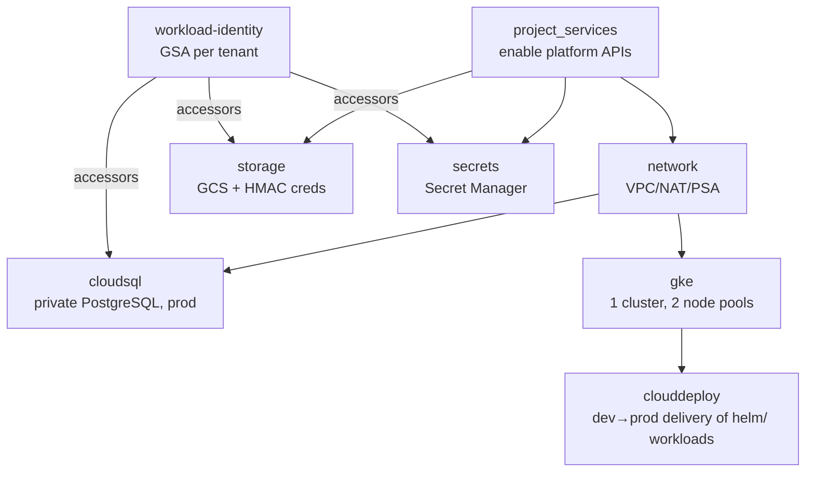
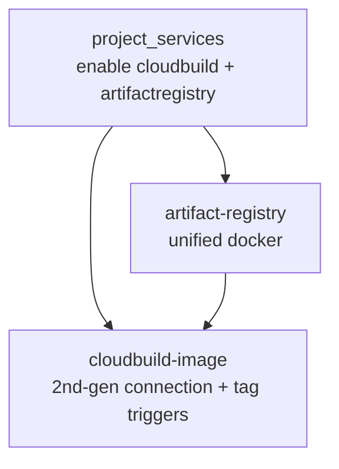

# YourOwn.Chat

Production-grade, cloud-agnostic-where-practical GCP platform, managed with
**HCP Terraform + Terraform Stacks**.

This repository implements the **first platform slice** as **two Terraform
Stacks** in a single GCP project:

- **`terraform/platform`** — one Stacks **deployment** (`platform`) provisioning a
  **single zonal GKE cluster with two node pools**, managed Cloud SQL, object
  storage and the Cloudflare-fronted public ingress. **prod and dev share this
  one cluster**: prod runs on a dedicated, tainted node pool; **dev is an
  isolated tenant namespace** (RBAC + default-deny NetworkPolicies) scheduled
  onto its own node pool.
- **`terraform/build`** — the container CI: one **unified** Artifact Registry
  repository (`docker`) plus the Mattermost image build (Cloud Build),
  promoting a single image across environments by git tag.

| Capability | Implementation |
|------------|----------------|
| PostgreSQL database (Germany) | Cloud SQL for PostgreSQL, private IP, `europe-west3`, PITR + 7-day backups (prod) |
| Object storage ("S3") | Cloud Storage bucket, `EUROPE-WEST3` (+ S3-compatible HMAC creds for Mattermost) |
| Kubernetes | **One** zonal GKE Standard cluster, private nodes, **two node pools**: prod `e2-standard-2` (on-demand, tainted) + dev `e2-small` (on-demand, untainted) |
| Container registry | **One unified** Artifact Registry (Docker) repo `docker`, owned by the build stack |
| CI build | Cloud Build (2nd-gen GitHub trigger, dedicated least-privilege SA) builds the Mattermost image |
| CD to GKE | Cloud Deploy **dev→prod** pipeline delivers the `helm/` workloads across two GKE targets on the one cluster — dev renders the dev tenant + matterbridge with a post-deploy `verify`, prod renders the operator-managed Mattermost gated by approval |
| Secrets | **Every** credential in **Secret Manager**, mounted via the GKE Secret Manager CSI add-on + Workload Identity |
| Encryption at rest | One shared **Cloud KMS HSM** key (CMEK, FIPS 140-2 Level 3, 90-day rotation) encrypts Cloud SQL, GCS, Secret Manager, and Artifact Registry — customer-controlled key lifecycle over Google's default AES-256 |
| Apps | prod Mattermost (operator CR + managed Cloud SQL) and dev Mattermost + matterbridge + in-cluster Postgres, all on the one cluster |

> There is no "S3" on GCP — the equivalent is a **Cloud Storage (GCS) bucket**,
> which is what this stack provisions in the same German region.

---

## Architecture rationale & tradeoffs

The brief asks for a **production-grade** platform *and* the **cheapest** GKE,
under a ~**$100/mo** ceiling. The topology is therefore **one zonal cluster with
two node pools**, not a cluster per environment: GKE's free tier waives the
management fee for only **one** zonal cluster per billing account, so a second
cluster would add ~$74/mo and break the budget. dev/prod isolation is achieved
**in-cluster** instead of physically:

- a dedicated, **tainted** prod node pool (`e2-standard-2`, `dedicated=prod`) so
  dev workloads can never contend with prod for CPU/memory;
- an **untainted** dev node pool (`e2-small`) that also hosts `kube-system`
  (CoreDNS etc.), so the dev tenant and system pods share the cheap pool —
  **on-demand, not Spot**, because preempting this pool would take CoreDNS down
  for prod too;
- **namespace RBAC** (dev team scoped to the `dev` namespace only) and
  **default-deny NetworkPolicies** in `dev` (see `helm/developing/`), so the dev
  tenant cannot reach prod (or any other namespace) on the pod network.

| Line item | Config | ~$/mo |
|-----------|--------|-------|
| GKE control plane | 1 zonal cluster | $0 (free tier) |
| prod node pool | 1× `e2-standard-2`, on-demand | ~$49 |
| dev node pool | 1× `e2-small`, on-demand | ~$12 |
| prod Cloud SQL | `db-f1-micro`, 20Gi SSD, PITR + 7-day backups | ~$12–15 |
| prod GCS (filestore) | Standard, small | ~$2 |
| dev PVCs (in-cluster pg 5Gi + local filestore 10Gi) | pd-standard | ~$1 |
| Buffer (egress/growth) | | ~$10–15 |
| **Total** | | **~$86–93** |

Every cost/HA knob is a typed variable with a production-safe path:

| Concern | Default | Harden (flip a variable) |
|---------|---------|--------------------------|
| GKE control plane | Zonal (free-tier eligible) | `gke_regional = true` |
| prod nodes | 1× `e2-standard-2`, on-demand | bump `max_count` / machine type |
| prod Cloud SQL | `db-f1-micro`, `ZONAL`, PITR on | `db-custom-*`, `REGIONAL` (HA) |
| dev database | in-cluster Postgres (`cloudsql_enabled=false` for the dev tenant) | promote dev to managed Cloud SQL |
| Environments | one cluster, dev as a namespace tenant | add a separate cluster/deployment for a hard split |
| Control-plane access | `master_authorized_networks` (CI CIDR) | keep restricted |

Non-negotiable production practices are kept **even at this budget**: private
nodes + Cloud NAT egress, Workload Identity, Shielded Nodes, private-IP Cloud SQL
over Private Service Access, uniform bucket access + public-access prevention,
dedicated least-privilege service accounts, **all secrets in Secret Manager**,
and **customer-managed encryption (CMEK)** on by default — one shared Cloud KMS
HSM key across Cloud SQL, GCS, Secret Manager, and Artifact Registry.

**Dev/prod isolation on one cluster:** the tainted prod pool guarantees resource
isolation; `nodeSelector tier=prod|dev` on the Kubernetes manifests pins each tier to
its pool. On top of scheduling, the `dev` namespace gets default-deny ingress and
egress NetworkPolicies (allow only intra-namespace + DNS + egress to public IPs,
never to other in-cluster namespaces) and a namespace-scoped RBAC Role/RoleBinding
for the dev team — no cluster-scoped rights, no path to prod.

**GKE Standard vs Autopilot:** Standard is chosen because the target
architecture calls for explicit multiple node pools and node-level cost control
(machine type, disk, taints) that Autopilot abstracts away.

**Why the registry lives in the build stack:** a single cross-environment
registry has no natural home in a per-environment platform deployment, and
co-locating it with the CI that writes to it avoids a `platform <-> build`
dependency cycle (the build stack already depends on the platform stack for API
enablement). GKE nodes still pull from it with zero cross-stack IAM because the
node SA holds project-level `artifactregistry.reader`.

## Dependency graph

**platform stack**



**build stack**



Ordering is expressed by components referencing each other's outputs — explicit
dependencies, no implicit ordering. Workload Identity SA emails flow into the
secret-owning components as least-privilege `secretAccessor` members. Each stack
enables the APIs it owns via its own `project_services` component (no overlap);
only a minimal bootstrap set (auth + Service Usage + Secret Manager) and the
`github-pat` secret are done once in [`docs/INIT.md`](docs/INIT.md). So the
platform and build stacks are independent and can be applied in any order.

## Repository layout

```
terraform/                  # each subdir is ONE Terraform Stacks configuration
  platform/                 # the platform stack (network, GKE, data, secrets, ...)
    .terraform-version      # Terraform Core version pin (read by HCP Stacks + CI)
    .terraform.lock.hcl     # provider lock (committed at the stack root)
    providers.tfcomponent.hcl  # stack provider requirements + configuration
    variables.tfcomponent.hcl  # typed stack input variables
    components.tfcomponent.hcl # component wiring (one block per building block)
    outputs.tfcomponent.hcl    # stack outputs
    deployments.tfdeploy.hcl   # ONE `platform` deployment (1 cluster, 2 node pools)
    modules/                # small, single-purpose, reusable modules (this stack)
      project-services/     # enable the platform-owned Google APIs
      network/              # VPC, subnet(+secondary ranges), Router, NAT, PSA
      gke/                  # zonal Standard cluster + node_pools map + WI + CSI
      cloudsql/             # private PostgreSQL + DB + user + password/conn secrets
      storage/              # GCS bucket (+ optional Mattermost S3 HMAC creds)
      kms/                  # one shared Cloud KMS HSM key (CMEK) + service-agent grants
      clouddeploy/          # dev→prod delivery pipeline + 2 GKE targets + exec SA
      secrets/              # Secret Manager map (generate/provide + accessors)
      workload-identity/    # per-tenant GSA bound to a KSA (WI)
  build/                    # the build stack (unified registry + Mattermost image CI)
    providers.tfcomponent.hcl  # google + google-beta, same keyless auth
    variables.tfcomponent.hcl
    components.tfcomponent.hcl # project_services + artifact_registry (docker) + mattermost_image
    outputs.tfcomponent.hcl    # unified image path + registry/trigger/connection IDs
    deployments.tfdeploy.hcl   # single `build` deployment (routes by git tag)
    modules/
      project-services/    # enable the build-owned Google APIs (cloudbuild, artifactregistry)
      artifact-registry/    # the unified Docker repo (moved here from platform)
      cloudbuild-image/     # 2nd-gen GitHub connection + repo + tag-triggered builds
helm/                       # Kubernetes workloads, delivered by Cloud Deploy dev→prod
  skaffold.yaml             # dev/prod profiles Cloud Deploy renders (+ dev verify)
  cloudbuild.yaml           # illustrative: cut a Cloud Deploy release from helm/
  namespaces.yaml           # mattermost (prod) + matterbridge + dev tenants
  mattermost/               # prod: SA + SecretProviderClass + secret-sync + operator CR
  matterbridge/             # SA + SecretProviderClass + Deployment + NetworkPolicy (dev pool)
  developing/               # SA/SPC + in-cluster Postgres + dev Mattermost +
                            #   networkpolicy.yaml + rbac.yaml (tenant isolation)
    verify/                 #   on-cluster smoke-test Job template (dev-stage verify)
  ingress-nginx/            # Cloudflare-only ingress values + bootstrap runbook
.gitlab-ci.yml              # module fmt/validate + manifest lint
```

> Stack layout: the repo hosts **two** Terraform Stacks configurations, one per
> `terraform/<name>/` directory (`platform` and `build`), each using the
> `*.tfcomponent.hcl` (components, providers, variables, outputs) and
> `*.tfdeploy.hcl` (deployments) suffixes Terraform Stacks requires. HCP reads
> **one stack per working directory**, so each stack is its own HCP Stack with
> its working directory set to `terraform/platform` or `terraform/build`. Modules are
> **co-located under each stack** (`terraform/<name>/modules/`) and referenced as
> `./modules/X`: the Stacks source bundler roots the bundle at the stack config
> directory and cannot follow `../` sources that escape it, so a shared
> top-level `infra/modules/` is not reachable from a nested stack. The two
> stacks use disjoint module sets, so co-location adds no duplication. Each stack
> commits its own `.terraform.lock.hcl` for reproducible runs.

> Version pin: HCP Terraform Stacks selects the Terraform Core version from each
> stack's **`.terraform-version`** file (currently `1.15.8`). The GitLab CI
> images are pinned to the same version so local, CI, and HCP runs agree.

> Separation of concerns: **infra** (Terraform) provisions cloud resources and
> **helm/** holds the chat workloads, delivered to the cluster by the Cloud
> Deploy dev→prod pipeline — infrastructure and workloads are kept apart.

## Deploying (HCP Terraform Stacks)

1. Create **one** GCP project with billing linked, or reuse an existing one.
   This slice does **not** create projects/org (that is a separate future
   foundation stack requiring org + billing permissions).
1. Run the one-time bootstrap in [`docs/INIT.md`](docs/INIT.md): enable the
   bootstrap APIs (auth + Service Usage + Secret Manager), create the Workload
   Identity Federation pool/provider and `terraform plan`/`apply` service accounts
   (with all IAM roles both stacks need), and create the `github-pat` secret. The
   stacks enable every other API themselves; this is the only manual prerequisite,
   after which the two stacks are independent.
2. In `terraform/platform/deployments.tfdeploy.hcl` the project ID (`yourown-chat`),
   WIF `audience` and apply-SA are already wired; set the real
   `master_authorized_networks` CIDR if you want to restrict the control plane
   (empty = reachable but credential-gated, so Cloud Deploy can reach it).
3. Configure **keyless** GCP auth in HCP Terraform (no credentials are ever
   committed). The Workload Identity Federation pool/provider and least-privilege
   `terraform plan`/`apply` service accounts are documented in
   [`docs/INIT.md`](docs/INIT.md); the `audience` and
   `service_account_email` inputs are already wired to that setup. HCP mints the
   OIDC token via the `identity_token` block (its `aud` matches the provider's
   allowed-audiences); the google provider exchanges it through WIF
   (`external_credentials`) and impersonates the apply SA.
4. Create the Stack in HCP Terraform with its **working directory set to
   `terraform/platform`**, then plan and apply the single `platform` deployment.
   (An existing Stack that pointed at the repo root must be updated to this
   working directory after the reorg.)
5. Deploy the chat workloads from [`helm/`](helm/README.md): install the
   ingress-nginx controller + Mattermost operator, replace the `REPLACE-ME-*`
   markers (project ID, bucket, Workload Identity SA emails from
   `terraform output workload_identity_emails`, the dev-team RBAC principal),
   then apply the manifests (namespaces, then per-tenant resources including
   `helm/developing/networkpolicy.yaml` and `helm/developing/rbac.yaml`).
6. (For custom Mattermost images) Create a **second** HCP Stack with working
   directory **`terraform/build`** and follow [`docs/BUILD.md`](docs/BUILD.md) to
   set the Cloud Build App installation ID. The shared apply-SA roles, the
   bootstrap APIs and the `github-pat` secret all come from `docs/INIT.md`, and
   this stack enables its own `cloudbuild`/`artifactregistry` APIs, so it is
   independent of the platform stack and can be applied in any order.

## CI/CD flow

**Mattermost image (build stack, `terraform/build`)** — build once, push to
the one unified registry, promote by tag:

```
git tag on github.com/pilprod/mattermost ──► Cloud Build (2nd-gen trigger)
   ^v.*-patched$   ─► build Dockerfile ─► push docker/mattermost:<tag>
```

- One Cloud Build 2nd-gen GitHub connection + repository watches the external
  Mattermost source repo; a single tag pattern (`^v.*-patched$`) builds **one**
  image, and that same artifact is deployed to dev and prod (promoted, not
  rebuilt per environment). Builds run as a dedicated, least-privilege runtime SA
  (`img-build`: repo-scoped AR writer + log writer only). The Terraform that
  provisions the build stack impersonates the **shared** `terraform-apply@` SA
  (the same single account the platform uses). See [`docs/BUILD.md`](docs/BUILD.md).
- The resulting image is referenced in both Mattermost manifests: prod
  `helm/mattermost/mattermost.yaml` (`spec.image` + `version`), dev
  `helm/developing/mattermost-dev.yaml`.

**Delivery to GKE (platform stack)** — the `clouddeploy` component provisions a
Cloud Deploy **dev → prod** pipeline that delivers the `helm/` Kubernetes
workloads: two GKE targets (`europe-west3-dev`, `europe-west3-prod`) on the one cluster, each
rendering a Skaffold profile from [`helm/skaffold.yaml`](helm/skaffold.yaml). The
**dev** target deploys the dev tenant (in-cluster Postgres + dev Mattermost) and
matterbridge, then runs a post-deploy **`verify`** smoke test on the cluster; the
**prod** target deploys the operator-managed Mattermost, with **`requireApproval`**
gating promotion. The Mattermost image is **built once** by the build stack and
promoted by tag — dev and prod reference the same tag in-manifest, so Cloud Deploy
promotes the identical manifests rather than rebuilding. The demo Cloud Build
identity that previously lived in the platform stack was removed: with the
registry now owned by the build stack, a platform-side writer binding would
create a `platform -> build` dependency cycle.

## Security considerations

- Least-privilege, per-purpose service accounts (node, image-build, deploy,
  per-tenant Workload Identity; a single shared Terraform plan/apply SA for both
  stacks); the default compute SA is never used.
- Private GKE nodes; egress only via Cloud NAT; Workload Identity for every pod
  that touches GCP.
- **Dev tenant isolation:** namespace-scoped RBAC (dev team limited to `dev`, no
  cluster rights), default-deny ingress/egress NetworkPolicies in `dev`
  (Dataplane V2 enforced), and `automountServiceAccountToken: false` on the dev
  workload SA (the dev workloads never call the Kubernetes API).
- Cloud SQL private IP only (`ipv4_enabled = false`), `ENCRYPTED_ONLY` TLS.
- **Encryption (CMEK):** one shared Cloud KMS **HSM** key (FIPS 140-2 Level 3,
  90-day rotation) encrypts Cloud SQL, the GCS bucket, and Secret Manager.
  At-rest data is AES-256 regardless; CMEK moves key custody + lifecycle
  (rotation, disable, destroy = crypto-shred) to us. The platform stack owns the
  key and grants each service agent `encrypterDecrypter`. The build stack's
  container registry is **public** and deliberately not CMEK-encrypted, so the
  build stack has no CMEK dependency on the platform stack. Toggle via
  `cmek_enabled` / `kms_protection_level` (`HSM` → `SOFTWARE` for ~$0.06/mo).
- **All secrets in Secret Manager** — DB password + connection URI (cloudsql),
  GCS S3-compatible HMAC keys (storage), dev Postgres password + matterbridge
  config + Cloudflare origin material (secrets module), each secret replica
  encrypted with the shared CMEK key. None are surfaced as
  plaintext outputs; pods read them via the GKE Secret Manager CSI add-on, gated
  by per-tenant `secretAccessor` IAM (a workload can read only its own secrets).
- Public ingress: prod Mattermost is exposed at `yourown.chat` only through
  Cloudflare — ingress-nginx admits only Cloudflare source ranges and enforces
  Authenticated Origin Pulls (mTLS) + Full (Strict) TLS. dev has no public
  ingress. See [`helm/ingress-nginx/README.md`](helm/ingress-nginx/README.md).
- Buckets: uniform bucket-level access + public access prevention enforced.

## Future scalability

Modules are intentionally small so the rest of the platform vision (Vault,
Authentik, cert-manager, ExternalDNS, Prometheus/Grafana/Loki) slots in as **new
components** in the same Stack, and additional MCP servers as Kubernetes workloads +
Workload Identity tenants — no root-module rewrites. Mattermost and matterbridge
already run as Kubernetes workloads in [`helm/`](helm/). The network module is
hub-and-spoke-ready and provisions PSA for future private managed services. If the
budget later rises, a hard dev/prod split is one more `deployment` (or a second
cluster); hardening prod is flipping `gke_regional` / `cloudsql_availability_type`.
The unified registry is ready for more images (add a build to the `builds` map).

## Decisions made autonomously — please review

These reflect the decisions we converged on; each is easy to change:

1. **Region:** `europe-west3` (Frankfurt) over `europe-west10` (Berlin) —
   cheaper and more mature. One-variable change.
2. **Topology:** **one** zonal cluster with two node pools; dev is an isolated
   **namespace tenant** (RBAC + NetworkPolicy), not a second cluster. Keeps the
   ~$86–93/mo budget under the $100 ceiling while isolating dev from prod.
3. **Registry + CI:** a **single unified** Artifact Registry repo
   (`docker`) owned by the **build stack**; one Mattermost image promoted
   dev->prod by tag. The demo platform-side Cloud Build identity was removed to
   avoid a dependency cycle.
4. **Delivery:** a Cloud Deploy **dev→prod** pipeline delivers the `helm/`
   workloads (two GKE targets on the one cluster, dev `verify` + prod approval);
   the Mattermost image is built once and promoted by tag, so both tiers deploy
   the same manifests.
5. **Scope:** provisions into an **existing** `project_id`; org/project bootstrap
   deferred to a foundation stack.
6. **Cloud SQL:** prod only — `db-f1-micro` + PITR + 7-day backups, no HA (HA
   alone would consume most of the budget). The dev tenant uses in-cluster
   Postgres.
7. **Apps:** prod Mattermost via the operator CR (external Cloud SQL + GCS
   filestore); dev Mattermost + matterbridge as lightweight Deployments. Confirm
   the Mattermost operator version, ingress host, and matterbridge bridges.
8. **Auth model:** keyless OIDC -> WIF is wired (`external_credentials`) with the
   real `audience` and apply SA from `INIT.md`; both the platform
   and build stacks impersonate the shared `terraform-apply@`.
9. **Encryption (CMEK):** one shared Cloud KMS **HSM** key (FIPS 140-2 Level 3,
   ~$1/mo, 90-day rotation) encrypts Cloud SQL + GCS + Secret Manager + Artifact
   Registry, on by default. HSM (not SOFTWARE) is chosen so the expensive-to-change Cloud SQL key
   is right the first time — the instance binds its key at creation, so switching
   later means an instance migration. Flip `cmek_enabled = false` or
   `kms_protection_level = "SOFTWARE"` (~$0.06/mo) if you don't need FIPS L3.
