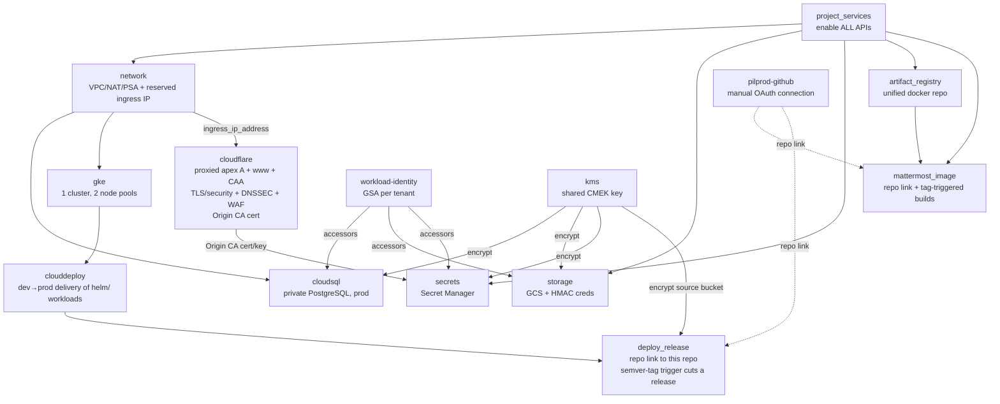

# YourOwn.Chat

Production-grade, cloud-agnostic-where-practical GCP platform, managed with
**HCP Terraform + Terraform Stacks**.

This repository implements the **first platform slice** as **one Terraform
Stack** (working directory `terraform/`) in a single GCP project. GCP, the
container CI and the Cloudflare edge are separate **components** of that one
stack, provisioned by a single **deployment** (`eu`):

- **GCP platform** — a **single zonal GKE cluster with two node pools**, managed
  Cloud SQL, object storage and the Cloudflare-fronted public ingress. **prod and
  dev share this one cluster**: prod runs on a dedicated, tainted node pool;
  **dev is an isolated tenant namespace** (RBAC + default-deny NetworkPolicies)
  scheduled onto its own node pool.
- **Container CI** — one **unified** Artifact Registry repository (`docker`) plus
  the Mattermost image build (Cloud Build 2nd-gen), promoting a single image
  across environments by git tag.
- **Cloudflare edge** — the public edge for `yourown.chat`: the proxied apex A
  record wired **live** to the platform ingress IP, plus zone TLS/security
  settings, DNSSEC, WAF rules and origin TLS. It carries the only non-GCP secret
  (a zone-scoped Cloudflare API token), which stays isolated from the keyless GCP
  components.

> **One stack, not three.** These used to be three separate stacks
> (`platform`, `build`, `cloudflare`) with manual hand-offs between them.
> Consolidating them into one deployment removes every cross-stack step: the
> ingress IP is wired live into the Cloudflare record, and the Cloudflare Origin
> CA cert/key flow straight into the platform origin-TLS secrets. One HCP Stack,
> zero hand-offs.

| Capability | Implementation |
|------------|----------------|
| PostgreSQL database (Germany) | Cloud SQL for PostgreSQL, private IP, `europe-west3`, PITR + 7-day backups (prod) |
| Object storage ("S3") | Cloud Storage bucket, `EUROPE-WEST3` (+ S3-compatible HMAC creds for Mattermost) |
| Kubernetes | **One** zonal GKE Standard cluster, private nodes, **two node pools**: prod `e2-standard-2` (on-demand, tainted) + dev `e2-small` (on-demand, untainted) |
| Container registry | **One unified** Artifact Registry (Docker) repo `docker`, an `artifact_registry` component |
| CI build | Cloud Build (2nd-gen GitHub trigger, dedicated least-privilege SA) builds the Mattermost image |
| CD to GKE | Cloud Deploy **dev→prod** pipeline delivers the `helm/` workloads across two GKE targets on the one cluster — dev renders the dev tenant + matterbridge with a post-deploy `verify`, prod renders the operator-managed Mattermost gated by approval. Release cutting is **automated**: a semver tag (`*.*.*`) on this repo triggers `gcloud deploy releases create` via the `deploy_release` component |
| Secrets | **Every** credential in **Secret Manager**, mounted via the GKE Secret Manager CSI add-on + Workload Identity |
| Encryption at rest | One shared **Cloud KMS HSM** key (CMEK, FIPS 140-2 Level 3, 90-day rotation) encrypts Cloud SQL, GCS and Secret Manager — customer-controlled key lifecycle over Google's default AES-256 (the public Artifact Registry is deliberately not CMEK-encrypted) |
| Apps | prod Mattermost (operator CR + managed Cloud SQL) and dev Mattermost + matterbridge + in-cluster Postgres, all on the one cluster |

> There is no "S3" on GCP — the equivalent is a **Cloud Storage (GCS) bucket**,
> which is what this stack provisions in the same German region.

---

## Google Cloud Initial Setup

One-time, out-of-band bootstrap that the Terraform **stack** depends on. Run this
**once** before applying; afterwards the single stack provisions the platform,
the image CI **and** the Cloudflare edge in one apply.

This guide:

- enables the **bootstrap** Google Cloud APIs (auth + Service Usage + Secret
  Manager) so Terraform can then enable the rest itself;
- creates the Workload Identity Pool and OIDC Provider;
- creates service accounts for `plan` and `apply` runs;
- grants impersonation permissions and all project IAM roles the stack needs;
- authorizes the shared Cloud Build GitHub connection (`pilprod-github`) the CI/CD reuses;
- configures HCP Terraform dynamic provider credentials;
- creates the Cloudflare API token the Cloudflare component reads (the only static
  secret, since Cloudflare has no Workload Identity path).

Everything the stack can provision itself (all other APIs, every cloud resource)
is left to Terraform -- this section is the single place for the manual, pre-Terraform
prerequisites.

### Auth flow

```
HCP Terraform run
   -> mints OIDC JWT   (identity_token "gcp", aud = full WIF provider URL)
   -> WIF provider     (issuer app.terraform.io, verifies org + project)
   -> STS token exchange (audience = full WIF provider resource name)
   -> impersonates the least-privilege apply SA
   -> short-lived access token
   -> google provider  (external_credentials) -> Google Cloud APIs
```

The Terraform side is already wired, so this section only creates the cloud-side
resources below:

- `terraform/deployments.tfdeploy.hcl` -> `identity_token "gcp"` and the single
  `eu` deployment already pass the real `audience` and
  `service_account_email` (`terraform-apply@`) -- no placeholders to fill.
- `terraform/providers.tfcomponent.hcl` -> `provider "google"` uses
  `external_credentials`.

### Input Values

| Variable | Value |
| --- | --- |
| `PROJECT_ID` | `yourown-chat` |
| `TFC_ORG` | `papou-work` |
| `TFC_PROJECT` | `yourown-chat` |
| `WIF_POOL_ID` | `hcp-terraform` |
| `WIF_PROVIDER_ID` | `hcp-terraform` |
| `PLAN_SA` | `terraform-plan` |
| `APPLY_SA` | `terraform-apply` |

### 1. Initialize Environment

```sh
export PROJECT_ID="yourown-chat"
export PROJECT_NUMBER="$(gcloud projects describe "$PROJECT_ID" --format='value(projectNumber)')"

export TFC_ORG="papou-work"
export TFC_PROJECT="yourown-chat"

export WIF_POOL_ID="hcp-terraform"
export WIF_PROVIDER_ID="hcp-terraform"

export PLAN_SA="terraform-plan"
export APPLY_SA="terraform-apply"
```

### 2. Enable the bootstrap APIs

Enable only the **bootstrap** APIs here -- the ones Terraform needs *before* it
can authenticate and enable anything else, plus Secret Manager (which holds the
credentials the stack generates but which the stack does not enable itself). Every
other API is enabled **by the stack
itself**: the `project_services` component enables everything the platform, the
image CI and the rest need (compute, container, sqladmin, cloudkms, storage,
clouddeploy, logging, monitoring, cloudbuild, artifactregistry). This list is the
single source of truth for manual API enablement.

```sh
gcloud services enable \
  cloudresourcemanager.googleapis.com \
  serviceusage.googleapis.com \
  iam.googleapis.com \
  iamcredentials.googleapis.com \
  sts.googleapis.com \
  secretmanager.googleapis.com \
  --project="$PROJECT_ID"
```

Expected result:

```text
Operation "operations/acat.p2-1086706391144-c515dbc5-41f7-440a-9ef0-10508fa565d4" finished successfully.
```

### 3. Create Workload Identity Pool

```sh
gcloud iam workload-identity-pools create "$WIF_POOL_ID" \
  --project="$PROJECT_ID" \
  --location="global" \
  --display-name="HCP Terraform"
```

Expected result:

```text
Created workload identity pool [hcp-terraform].
```

### 4. Create OIDC Provider for HCP Terraform

```sh
gcloud iam workload-identity-pools providers create-oidc "$WIF_PROVIDER_ID" \
  --project="$PROJECT_ID" \
  --location="global" \
  --workload-identity-pool="$WIF_POOL_ID" \
  --display-name="HCP Terraform OIDC" \
  --issuer-uri="https://app.terraform.io" \
  --allowed-audiences="https://iam.googleapis.com/projects/$PROJECT_NUMBER/locations/global/workloadIdentityPools/$WIF_POOL_ID/providers/$WIF_PROVIDER_ID" \
  --attribute-mapping="google.subject=assertion.sub,attribute.terraform_organization_name=assertion.terraform_organization_name,attribute.terraform_project_name=assertion.terraform_project_name,attribute.terraform_stack_name=assertion.terraform_stack_name,attribute.terraform_run_phase=assertion.terraform_run_phase" \
  --attribute-condition="assertion.terraform_organization_name=='papou-work' && assertion.terraform_project_name=='yourown-chat'"
```

Expected result:

```text
Created workload identity pool provider [hcp-terraform].
```

### 5. Create Service Accounts

```sh
gcloud iam service-accounts create "$PLAN_SA" \
  --project="$PROJECT_ID" \
  --display-name="HCP Terraform Plan"

gcloud iam service-accounts create "$APPLY_SA" \
  --project="$PROJECT_ID" \
  --display-name="HCP Terraform Apply"
```

Expected result:

```text
Created service account [terraform-plan].
Created service account [terraform-apply].
```

### 6. Allow HCP Terraform Impersonation

Create the principal set for the HCP Terraform organization:

```sh
export WIF_PRINCIPAL_SET="principalSet://iam.googleapis.com/projects/$PROJECT_NUMBER/locations/global/workloadIdentityPools/$WIF_POOL_ID/attribute.terraform_organization_name/$TFC_ORG"
```

Grant `roles/iam.workloadIdentityUser` to the `plan` service account:

```sh
gcloud iam service-accounts add-iam-policy-binding \
  "$PLAN_SA@$PROJECT_ID.iam.gserviceaccount.com" \
  --project="$PROJECT_ID" \
  --role="roles/iam.workloadIdentityUser" \
  --member="$WIF_PRINCIPAL_SET"
```

Grant `roles/iam.workloadIdentityUser` to the `apply` service account:

```sh
gcloud iam service-accounts add-iam-policy-binding \
  "$APPLY_SA@$PROJECT_ID.iam.gserviceaccount.com" \
  --project="$PROJECT_ID" \
  --role="roles/iam.workloadIdentityUser" \
  --member="$WIF_PRINCIPAL_SET"
```

Expected principal set:

```text
principalSet://iam.googleapis.com/projects/1086706391144/locations/global/workloadIdentityPools/hcp-terraform/attribute.terraform_organization_name/papou-work
```

### 7. Grant Project IAM Roles

#### Roles for the plan service account

```sh
gcloud projects add-iam-policy-binding "$PROJECT_ID" \
  --member="serviceAccount:$PLAN_SA@$PROJECT_ID.iam.gserviceaccount.com" \
  --role="roles/viewer"

gcloud projects add-iam-policy-binding "$PROJECT_ID" \
  --member="serviceAccount:$PLAN_SA@$PROJECT_ID.iam.gserviceaccount.com" \
  --role="roles/browser"
```

#### Roles for the apply service account

The `terraform-apply@` SA backs the whole stack, so grant it every role the stack
needs here (single source of truth). `serviceUsageAdmin` is what lets the stack
enable its own APIs via Terraform.

```sh
export APPLY="serviceAccount:$APPLY_SA@$PROJECT_ID.iam.gserviceaccount.com"

for ROLE in \
  roles/serviceusage.serviceUsageAdmin \
  roles/resourcemanager.projectIamAdmin \
  roles/iam.serviceAccountAdmin \
  roles/iam.serviceAccountUser \
  roles/secretmanager.admin \
  roles/container.admin \
  roles/compute.networkAdmin \
  roles/compute.securityAdmin \
  roles/cloudkms.admin \
  roles/cloudsql.admin \
  roles/storage.admin \
  roles/clouddeploy.admin \
  roles/artifactregistry.admin \
  roles/cloudbuild.connectionAdmin \
  roles/cloudbuild.builds.editor ; do
  gcloud projects add-iam-policy-binding "$PROJECT_ID" \
    --member="$APPLY" --role="$ROLE" --condition=None
done
```

Why each role:

- `serviceusage.serviceUsageAdmin` — the stack enables its own APIs
  (`project_services`).
- `resourcemanager.projectIamAdmin` — project-level IAM bindings (e.g. the GKE
  node SA's `artifactregistry.reader`, the build SA's `logging.logWriter`).
- `iam.serviceAccountAdmin` + `iam.serviceAccountUser` — create the per-tenant /
  build service accounts and `actAs` them.
- `secretmanager.admin` — create and manage the secrets the stack stores (Cloud
  SQL connection/URI, GCS HMAC keys, dev Postgres password, matterbridge tokens,
  Cloudflare Origin CA cert) and grant tenants `secretAccessor`.
- `container.admin`, `compute.networkAdmin`, `compute.securityAdmin` — GKE +
  VPC/NAT/PSA + reserved IP, plus firewall rules. `networkAdmin` can read
  firewalls but NOT create them (`compute.firewalls.create/update/delete` live
  in `securityAdmin`), so both are required for the `network` component's
  `allow-internal` rule.
- `cloudkms.admin` — create the shared CMEK key ring + HSM key and grant the
  Cloud SQL / GCS / Secret Manager service agents `encrypterDecrypter`.
- `cloudsql.admin` — create the private PostgreSQL instance (`europe-west3-pg`) +
  database + user (the `cloudsql` component).
- `storage.admin` — create the GCS bucket and the Mattermost S3-compatible HMAC
  keys (the `storage` component; `storage.buckets.create` + `storage.hmacKeys.create`).
- `clouddeploy.admin` — create the delivery pipeline + dev/prod targets and bind
  the execution SA (the `clouddeploy` and `deploy-release` components).
- `artifactregistry.admin` — create the `docker` repo and grant the build SA
  `writer` on it.
- `cloudbuild.connectionAdmin`, `cloudbuild.builds.editor` — link the
  repositories to the existing 2nd-gen connection (`pilprod-github`) and create
  the tag triggers.

> Start broad to keep the first apply unblocked without granting Owner/Editor;
> tighten later by swapping project roles for resource-scoped IAM conditions once
> names stabilise.

### Resulting Roles

| Service account | Roles |
| --- | --- |
| `terraform-plan@yourown-chat.iam.gserviceaccount.com` | `roles/viewer`, `roles/browser` |
| `terraform-apply@yourown-chat.iam.gserviceaccount.com` | `roles/serviceusage.serviceUsageAdmin`, `roles/resourcemanager.projectIamAdmin`, `roles/iam.serviceAccountAdmin`, `roles/iam.serviceAccountUser`, `roles/secretmanager.admin`, `roles/container.admin`, `roles/compute.networkAdmin`, `roles/compute.securityAdmin`, `roles/cloudkms.admin`, `roles/cloudsql.admin`, `roles/storage.admin`, `roles/clouddeploy.admin`, `roles/artifactregistry.admin`, `roles/cloudbuild.connectionAdmin`, `roles/cloudbuild.builds.editor` |

### Verification

Check the Workload Identity bindings:

```sh
gcloud iam service-accounts get-iam-policy \
  "$PLAN_SA@$PROJECT_ID.iam.gserviceaccount.com" \
  --project="$PROJECT_ID"

gcloud iam service-accounts get-iam-policy \
  "$APPLY_SA@$PROJECT_ID.iam.gserviceaccount.com" \
  --project="$PROJECT_ID"
```

Check the project IAM roles:

```sh
gcloud projects get-iam-policy "$PROJECT_ID" \
  --flatten="bindings[].members" \
  --filter="bindings.members:terraform-plan OR bindings.members:terraform-apply" \
  --format="table(bindings.role, bindings.members)"
```

### 8. Create the Cloud Build GitHub connection (for the CI/CD repos)

Two repositories are wired into Cloud Build 2nd-gen: `pilprod/mattermost`
(`mattermost_image` builds the image) and `pilprod/yourown-chat` (`deploy_release`
cuts a Cloud Deploy release on a semver tag). Both are linked to **one shared host
connection** that you create **once, by hand, in the Cloud Console** — the stack
never creates or owns the connection; it only references it by name and attaches
the two repositories + their tag triggers to it.

> **Why a console OAuth connection and not a PAT?** A 2nd-gen connection is
> authorized either interactively (the Console's *Authorize* button runs the
> GitHub OAuth flow and stores the *Google Cloud Build* token for you) or
> declaratively from a GitHub PAT in Secret Manager
> (`authorizer_credential.oauth_token_secret_version`). The PAT path is brittle:
> the token must itself have access to the App installation, and Cloud Build
> rejects it otherwise (*"the user token does not have access to installations"*).
> Terraform cannot run the interactive OAuth step, so we do it **once** in the
> Console — the reliable, Google-blessed path — and let the stack attach
> repositories to the resulting connection by its deterministic ID. No PAT, no
> Secret Manager secret, no installation-ID variable.

#### 8.1 Create the host connection (OAuth) and name it `pilprod-github`

1. In the Google Cloud console open **Cloud Build → Repositories (2nd gen) →
   Create host connection**, choose **GitHub**, and set the region to
   `europe-west3` (must match the stack's region).
2. Name the connection **`pilprod-github`** and click **Authorize** — this runs
   the GitHub OAuth flow and installs / configures the *Google Cloud Build* GitHub
   App on the `pilprod` account. Grant the App access to **both**
   `pilprod/mattermost` **and** `pilprod/yourown-chat` (one connection backs both
   repos, since both live under `pilprod`).
3. If the wizard offers an **Encryption** (CMEK) key, you can skip it — it only
   CMEK-encrypts the OAuth token Google stores (optional, not a credential you
   manage). Leave it Google-managed and click **Connect**.

The connection then shows `Enabled` with a **Provider auth account** of `pilprod`.
Do **not** link the repositories by hand — Terraform creates the
`google_cloudbuildv2_repository` links (and the tag triggers) under it on apply.

> **Why both repos?** The image build reads `pilprod/mattermost` (Mattermost
> **source**); the automated release cut reads `pilprod/yourown-chat` (this repo,
> which holds the **Helm charts** under `helm/`). On a semver tag
> (`MAJOR.MINOR.PATCH`) in this repo, `deploy_release` runs `gcloud deploy releases
> create --source=helm` for you (see [`helm/cloudbuild.yaml`](../helm/cloudbuild.yaml)
> for the equivalent manual command). One connection authorized on the `pilprod`
> account covers both repositories.

#### 8.2 Point the stack at the connection

The connection name is a single stack input with a sensible default:

- `github_connection_name` → **`pilprod-github`** (default in
  `terraform/deployments.tfdeploy.hcl`; change it only if you named the connection
  differently).

That is the only wiring needed — there is no PAT secret and no installation ID to
set. The apply SA already holds `roles/cloudbuild.connectionAdmin`, which lets it
create the repository links + tag triggers under the existing connection.

> **Rotating / re-scoping access.** Re-authorize or re-scope the *Google Cloud
> Build* App from the Console (or GitHub → *Settings → Applications*); the
> connection keeps the same name and ID, so no Terraform change is needed. If you
> ever delete and recreate the connection, keep the same name (`pilprod-github`)
> so the stack's repository links still resolve.

### 9. Create the Stack in HCP Terraform

1. Connect the repo and create **one** Stack with its **working directory set to
   `terraform/`**.
2. HCP reads the `*.tfcomponent.hcl` files + `deployments.tfdeploy.hcl` and the
   committed `.terraform.lock.hcl` (all five providers).
3. Attach the Cloudflare variable set (step 10) to this Stack.
4. Plan and apply the single `eu` deployment. The first plan proves
   federation end to end: if the token is rejected, re-check the provider's
   `--attribute-condition` (org + project) and that its `--allowed-audiences`
   matches the `identity_token` block's `audience` (the full
   `https://iam.googleapis.com/.../providers/...` URL). The one apply provisions
   the platform, the image CI **and** the Cloudflare edge together.

> Migrating from the old three-stack layout: delete (or repoint) the separate
> `platform` / `build` / `cloudflare` HCP Stacks and use this single Stack with
> working directory `terraform/`. State from a prior split layout is not carried
> over automatically.

### 10. Create the Cloudflare API token (for the Cloudflare component)

The `cloudflare` component manages the `yourown.chat` zone (DNS, edge
TLS/security settings, DNSSEC, WAF rules, Origin CA cert). Cloudflare has no
Workload Identity path, so this is the **only** static secret in the whole setup.
It never touches git or state — it is injected from an HCP variable set as an
ephemeral input.

#### 10.1 Create a zone-scoped API token

In the Cloudflare dashboard: **My Profile -> API Tokens -> Create Token ->
Create Custom Token**. Scope it to the `yourown.chat` zone only, with:

| Permission | Access | Needed for |
|------------|--------|-----|
| Zone -> Zone | Read | resolve the zone ID (always) |
| Zone -> DNS | Edit | apex A / www / extra / CAA records **and DNSSEC** (always) |
| Zone -> Zone Settings | Edit | SSL mode, HSTS, min TLS, HTTP/3, etc. (always) |
| Zone -> SSL and Certificates | Edit | issue the Origin CA cert for Full (Strict) — **on by default** (`cloudflare_manage_origin_cert`); also `cloudflare_aop_enabled` |
| Zone -> Zone WAF | Edit | *only if you set `cloudflare_custom_firewall_rules`, `cloudflare_managed_waf_enabled` or `cloudflare_rate_limit_rules`* |

The first four rows are the default configuration (DNS + settings + DNSSEC +
origin cert for Full Strict). Add the last row only when you enable WAF rules.
If you turn `cloudflare_manage_origin_cert` off (using a dashboard-created cert
instead), the SSL and Certificates row is not required.

**Zone Resources:** restrict to `Include -> Specific zone -> yourown.chat`.

**Client IP Address Filtering (leave OFF for HCP-managed runs):** do **not** pin
this token to an IP allowlist when the Stack runs on HCP Terraform's own
infrastructure. HCP executes `plan`/`apply` from **dynamic** AWS `us-east-1`
egress IPs that are **not** in its published ranges — the lists at
`https://app.terraform.io/api/meta/ip-ranges` (`api`, `vcs`, `notifications`,
`sentinel`) cover only fixed platform services (webhooks, notifications,
Sentinel, the API front door), **not** run execution. Allowlisting them makes
Cloudflare reject the provider's calls with
`Cannot use the access token from location: <ip> (9109)`. Rely on zone-scoping +
a short TTL + sensitive/ephemeral storage instead.

```bash
# For reference only — these are the FIXED platform ranges, NOT the plan/apply
# egress. Do not allowlist them for this token on HCP-managed runs (see above).
curl -s https://app.terraform.io/api/meta/ip-ranges | jq -r '.api[]'
```

Only use IP filtering if you run the Stack on a **self-hosted HCP agent** with a
fixed NAT egress — then pin the token to **that** NAT IP (an egress you control),
not to HCP's ranges.

**TTL (recommended):** set a **TTL / expiry** (e.g. 90 days) and rotate — see 10.3.

Copy the token value once (it is not shown again).

#### 10.2 Store it in an HCP variable set

1. In HCP Terraform, create a **variable set** and apply it to the Stack.
2. Add a **Terraform variable** (category *Terraform*, matching
   `category = "terraform"` in the `store "varset"` block) named
   `cloudflare_api_token` = the token. Tick **Sensitive**; leave **HCL
   unchecked** — the token is a plain string, not an HCL expression (HCL is only
   for list/map/object values).
3. In `terraform/deployments.tfdeploy.hcl`, set the `store "varset"` block's `id`
   to that variable set's ID. The token flows in as the ephemeral
   `cloudflare_api_token` input.

> No manual IP hand-off: the proxied apex A record is wired **live** to the
> reserved ingress IP inside the stack (`component.network.ingress_ip_address`),
> so there is nothing to copy between runs.

#### 10.3 Rotating / re-scoping the token

Cloudflare API tokens can be rolled without downtime:

1. **My Profile -> API Tokens ->** the token **-> Roll** (new value, same scope),
   or create a new custom token if you need to widen/narrow permissions.
2. Update the `cloudflare_api_token` value in the HCP variable set (10.2).
3. The next plan/apply picks it up — nothing in git or state changes.

#### 10.4 Operational toggles in the shared variable set

The same variable set (the `store "varset" "shared"` block) also carries
non-secret operational flags that you may need to flip between applies **without a
code change**. Add each as a **Terraform variable** (category *Terraform*):

| Key | Purpose |
|-----|---------|
| `cloudsql_adopt_existing_instance` | `true` for one apply to **import** a Cloud SQL instance that a create-wait timeout left orphaned (exists in GCP, missing from state) instead of re-creating it — Cloud SQL reserves a deleted instance name for ~1 week, so delete+recreate is not an option. Set back to `false` once the import lands. |

Keep the key present at all times (`true`/`false`) — removing it from the varset
makes the plan fail on the missing reference.

If you set a TTL, roll before expiry. Do **not** IP-filter this token for
HCP-managed runs (see 10.1); only pin it when the Stack runs on a self-hosted
agent with a fixed egress IP.

#### 10.4 Origin TLS secrets (handled during ingress setup)

With `cloudflare_manage_origin_cert = true` (default) the stack issues the Origin
CA cert and fills the `mattermost-origin-tls-cert` / `-key` secrets
automatically — **nothing to do here.** Authenticated Origin Pulls are **off by
default**; when you enable them the stack uploads the per-hostname client cert and
turns AOP on for you, so the only manual secret is the verification CA
(`cloudflare-origin-pull-ca`, the CA that signed that client cert). All of this is
covered where the ingress is set up — see
[`helm/ingress-nginx/README.md`](../helm/ingress-nginx/README.md) §3–4.

### Notes

- The **MCP runtime** service account is created **by the stack** via a Workload
  Identity component, not here, so it stays declarative and least-privilege.
- One `terraform-apply@` account backs both the `plan` and `apply` phases of the
  stack (the `terraform-plan` SA above is created and impersonable too, reserved
  for a stricter plan/apply split later). All of its roles are granted in step 7.
- Rotating trust = delete/recreate the provider; there are no keys to rotate.

---

## Architecture rationale & tradeoffs

The brief asks for a **production-grade** platform *and* the **cheapest** GKE,
under a ≈**$100/mo** ceiling. The topology is therefore **one zonal cluster with
two node pools**, not a cluster per environment: GKE's free tier waives the
management fee for only **one** zonal cluster per billing account, so a second
cluster would add ≈$74/mo and break the budget. dev/prod isolation is achieved
**in-cluster** instead of physically:

- a dedicated, **tainted** prod node pool (`e2-standard-2`, `dedicated=prod`) so
  dev workloads can never contend with prod for CPU/memory;
- an **untainted** dev node pool (`e2-small`) that also hosts `kube-system`
  (CoreDNS etc.), so the dev tenant and system pods share the cheap pool —
  **on-demand, not Spot**, because preempting this pool would take CoreDNS down
  for prod too;
- **namespace RBAC** (dev team scoped to the `dev` namespace only) and
  **default-deny NetworkPolicies** in `dev` (see `helm/developing/`), so the dev
  tenant cannot reach prod (or any other namespace) on the pod network.

| Line item | Config | ≈$/mo |
|-----------|--------|-------|
| GKE control plane | 1 zonal cluster | $0 (free tier) |
| prod node pool | 1× `e2-standard-2`, on-demand | ≈$49 |
| dev node pool | 1× `e2-small`, on-demand | ≈$12 |
| prod Cloud SQL | `db-f1-micro`, 20Gi SSD, PITR + 7-day backups | ≈$12–15 |
| prod GCS (filestore) | Standard, small | ≈$2 |
| dev PVCs (in-cluster pg 5Gi + local filestore 10Gi) | pd-standard | ≈$1 |
| Buffer (egress/growth) | | ≈$10–15 |
| **Total** | | **≈$86–93** |

Every cost/HA knob is a typed variable with a production-safe path:

| Concern | Default | Harden (flip a variable) |
|---------|---------|--------------------------|
| GKE control plane | Zonal (free-tier eligible) | `gke_regional = true` |
| prod nodes | 1× `e2-standard-2`, on-demand | bump `max_count` / machine type |
| prod Cloud SQL | `db-f1-micro`, `ZONAL`, PITR on | `db-custom-*`, `REGIONAL` (HA) |
| dev database | in-cluster Postgres (`cloudsql_enabled=false` for the dev tenant) | promote dev to managed Cloud SQL |
| Environments | one cluster, dev as a namespace tenant | add a separate cluster/deployment for a hard split |
| Control-plane access | `master_authorized_networks` (CI CIDR) | keep restricted |

Non-negotiable production practices are kept **even at this budget**: private
nodes + Cloud NAT egress, Workload Identity, Shielded Nodes, private-IP Cloud SQL
over Private Service Access, uniform bucket access + public-access prevention,
dedicated least-privilege service accounts, **all secrets in Secret Manager**,
and **customer-managed encryption (CMEK)** on by default — one shared Cloud KMS
HSM key across Cloud SQL, GCS, Secret Manager, and Artifact Registry.

**Dev/prod isolation on one cluster:** the tainted prod pool guarantees resource
isolation; `nodeSelector tier=prod|dev` on the Kubernetes manifests pins each tier to
its pool. On top of scheduling, the `dev` namespace gets default-deny ingress and
egress NetworkPolicies (allow only intra-namespace + DNS + egress to public IPs,
never to other in-cluster namespaces) and a namespace-scoped RBAC Role/RoleBinding
for the dev team — no cluster-scoped rights, no path to prod.

**GKE Standard vs Autopilot:** Standard is chosen because the target
architecture calls for explicit multiple node pools and node-level cost control
(machine type, disk, taints) that Autopilot abstracts away.

**Why the registry is its own component (not a separate stack):** a single
cross-environment registry has no natural home in a per-environment deployment,
but keeping it as an `artifact_registry` component in the one stack — next to the
`mattermost_image` CI that writes to it — is the simplest home. When the CI was a
separate stack, a platform-side writer binding would have created a
`platform <-> build` cycle; inside one stack the dependency is a plain component
reference and the cycle disappears. GKE nodes still pull with zero extra IAM
because the node SA holds project-level `artifactregistry.reader`.

## Dependency graph

One stack, one deployment (`eu`), all components below:



Ordering is expressed by components referencing each other's outputs — explicit
dependencies, no implicit ordering. Two former cross-stack hand-offs are now live
component references: the reserved `ingress_ip_address` flows straight into the
Cloudflare apex A record, and the Cloudflare Origin CA cert/key flow straight
into the `mattermost-origin-tls-*` secrets. Workload Identity SA emails flow into
the secret-owning components as least-privilege `secretAccessor` members. The one
`project_services` component enables every API the product needs; only a minimal
bootstrap set (auth + Service Usage + Secret Manager) and the shared Cloud Build
GitHub connection are done once in [Google Cloud Initial Setup](#google-cloud-initial-setup).

## Repository layout

```
terraform/                  # ONE Terraform Stacks configuration (the whole product)
  .terraform-version        # Terraform Core version pin (read by HCP Stacks + CI)
  .terraform.lock.hcl       # provider lock (all 5 providers, committed at the root)
  providers.tfcomponent.hcl # stack provider requirements: google, google-beta, random, cloudflare, tls
  variables.tfcomponent.hcl # typed stack input variables (GCP + build + cloudflare)
  components.tfcomponent.hcl # component wiring (one block per building block)
  outputs.tfcomponent.hcl    # stack outputs (platform + image CI + release + cloudflare)
  deployments.tfdeploy.hcl   # ONE `eu` deployment (identity_token + cloudflare varset)
  modules/                  # small, single-purpose, reusable modules
    project-services/       # enable ALL Google APIs the product needs (one place)
    network/                # VPC, subnet(+secondary ranges), Router, NAT, PSA, reserved IP
    gke/                    # zonal Standard cluster + node_pools map + WI + CSI
    cloudsql/               # private PostgreSQL + DB + user + password/conn secrets
    storage/                # GCS bucket (+ optional Mattermost S3 HMAC creds)
    kms/                    # one shared Cloud KMS HSM key (CMEK) + service-agent grants
    clouddeploy/            # dev→prod delivery pipeline + 2 GKE targets + exec SA
    secrets/                # Secret Manager map (generate/provide + accessors)
    workload-identity/      # per-tenant GSA bound to a KSA (WI)
    artifact-registry/      # the unified Docker repo
    cloudbuild-image/       # repo link on the shared 2nd-gen connection + tag-triggered builds
    deploy-release/         # repo link on the shared connection + releaser SA + semver-tag trigger (cuts Cloud Deploy releases)
    cloudflare/             # DNS records + edge TLS/security + DNSSEC + WAF + Origin CA cert / AOP
helm/                       # Kubernetes workloads, delivered by Cloud Deploy dev→prod
  skaffold.yaml             # dev/prod profiles Cloud Deploy renders (+ dev verify)
  cloudbuild.yaml           # the release-cut command the deploy_release trigger runs (also usable by hand)
  namespaces.yaml           # mattermost (prod) + matterbridge + dev tenants
  mattermost/               # prod: SA + SecretProviderClass + secret-sync + operator CR
  matterbridge/             # SA + SecretProviderClass + Deployment + NetworkPolicy (dev pool)
  developing/               # SA/SPC + in-cluster Postgres + dev Mattermost +
                            #   networkpolicy.yaml + rbac.yaml (tenant isolation)
    verify/                 #   on-cluster smoke-test Job template (dev-stage verify)
  ingress-nginx/            # Cloudflare-only ingress values + bootstrap runbook
.gitlab-ci.yml              # module fmt/validate + manifest lint
```

> Stack layout: the repo hosts **one** Terraform Stacks configuration at
> `terraform/`, using the `*.tfcomponent.hcl` (components, providers, variables,
> outputs) and `*.tfdeploy.hcl` (deployments) suffixes Terraform Stacks requires.
> HCP reads **one stack per working directory**, so there is a single HCP Stack
> with its working directory set to `terraform/`. Modules are co-located under
> `terraform/modules/` and referenced as `./modules/X`: the Stacks source bundler
> roots the bundle at the stack config directory and cannot follow `../` sources
> that escape it. The stack commits one `.terraform.lock.hcl` (covering all five
> providers) for reproducible runs.

> Version pin: HCP Terraform Stacks selects the Terraform Core version from the
> stack's **`.terraform-version`** file (currently `1.15.8`). The GitLab CI
> images are pinned to the same version so local, CI, and HCP runs agree.

> Separation of concerns: **infra** (Terraform) provisions cloud resources and
> **helm/** holds the chat workloads, delivered to the cluster by the Cloud
> Deploy dev→prod pipeline — infrastructure and workloads are kept apart.

## Deploying (HCP Terraform Stacks)

1. Create **one** GCP project with billing linked, or reuse an existing one.
   This slice does **not** create projects/org (that is a separate future
   foundation stack requiring org + billing permissions).
1. Run the one-time bootstrap in [Google Cloud Initial Setup](#google-cloud-initial-setup): enable the
   bootstrap APIs (auth + Service Usage + Secret Manager), create the Workload
   Identity Federation pool/provider and `terraform plan`/`apply` service accounts
   (with all IAM roles the stack needs), authorize the shared Cloud Build GitHub
   connection, and
   create the Cloudflare API token + HCP variable set. The stack enables every
   other API itself; these are the only manual prerequisites.
2. In `terraform/deployments.tfdeploy.hcl` the project ID (`yourown-chat`), WIF
   `audience` and apply-SA are already wired; set the real
   `master_authorized_networks` CIDR if you want to restrict the control plane
   (empty = reachable but credential-gated, so Cloud Deploy can reach it), adjust
   `github_connection_name` only if your Cloud Build connection is not named
   `pilprod-github`, and replace the `store "varset"` id with your
   HCP variable set ID.
3. Configure **keyless** GCP auth in HCP Terraform (no credentials are ever
   committed). The Workload Identity Federation pool/provider and least-privilege
   `terraform plan`/`apply` service accounts are documented in
   [Google Cloud Initial Setup](#google-cloud-initial-setup); the `audience` and `service_account_email`
   inputs are already wired to that setup. HCP mints the OIDC token via the
   `identity_token` block (its `aud` matches the provider's allowed-audiences); the
   google provider exchanges it through WIF (`external_credentials`) and
   impersonates the apply SA.
4. Create **one** Stack in HCP Terraform with its **working directory set to
   `terraform/`**, attach the Cloudflare variable set to it, then plan and apply
   the single `eu` deployment. (An existing Stack that pointed at
   `terraform/platform` must be updated to this working directory after the
   reorg.) The one apply provisions the platform, the image CI **and** the
   Cloudflare edge together — the ingress IP and the Origin CA cert are wired
   internally, so there is nothing to copy between runs.
5. Deploy the chat workloads from [`helm/`](helm/README.md): install the
   ingress-nginx controller + Mattermost operator, replace the `REPLACE-ME-*`
   markers (project ID, bucket, Workload Identity SA emails from
   `terraform output workload_identity_emails`, the dev-team RBAC principal),
   then apply the manifests (namespaces, then per-tenant resources including
   `helm/developing/networkpolicy.yaml` and `helm/developing/rbac.yaml`).

The image-build flow (the shared Cloud Build connection, the tag
pattern, promotion) is described in [`docs/BUILD.md`](docs/BUILD.md); it is part
of this same stack, so there is no separate stack to create.

## CI/CD flow

**Mattermost image (the `mattermost_image` component)** — build once, push to
the one unified registry, promote by tag:

```
git tag on github.com/pilprod/mattermost ──► Cloud Build (2nd-gen trigger)
   ^v.*-patched$   ─► build Dockerfile ─► push docker/mattermost:<tag>
```

- One Cloud Build 2nd-gen repository — linked to the shared `pilprod-github`
  connection — watches the external
  Mattermost source repo; a single tag pattern (`^v.*-patched$`) builds **one**
  image, and that same artifact is deployed to dev and prod (promoted, not
  rebuilt per environment). Builds run as a dedicated, least-privilege runtime SA
  (`img-build`: repo-scoped AR writer + log writer only). The Terraform apply
  impersonates the least-privilege `terraform-apply@` SA. See
  [`docs/BUILD.md`](docs/BUILD.md).
- The resulting image is referenced in both Mattermost manifests: prod
  `helm/mattermost/mattermost.yaml` (`spec.image` + `version`), dev
  `helm/developing/mattermost-dev.yaml`.

**Delivery to GKE (the `clouddeploy` component)** — provisions a Cloud Deploy
**dev → prod** pipeline that delivers the `helm/` Kubernetes workloads: two GKE
targets (`europe-west3-dev`, `europe-west3-prod`) on the one cluster, each
rendering a Skaffold profile from [`helm/skaffold.yaml`](helm/skaffold.yaml). The
**dev** target deploys the dev tenant (in-cluster Postgres + dev Mattermost) and
matterbridge, then runs a post-deploy **`verify`** smoke test on the cluster; the
**prod** target deploys the operator-managed Mattermost, with **`requireApproval`**
gating promotion. The Mattermost image is **built once** by the `mattermost_image`
component and promoted by tag — dev and prod reference the same tag in-manifest,
so Cloud Deploy promotes the identical manifests rather than rebuilding. Because
the registry and CI are components of the same stack (not a separate one), the
registry writer binding is a plain component reference with no dependency cycle.

**Automated release cutting (the `deploy_release` component)** — a git tag, not a
human, cuts the Cloud Deploy release:

```
git tag on github.com/pilprod/yourown-chat ──► Cloud Build (2nd-gen trigger)
   MAJOR.MINOR.PATCH  ─► gcloud deploy releases create ─► clouddeploy pipeline
```

- A **second** Cloud Build 2nd-gen repository — on the **same** shared connection
  — watches **this** repo (which holds
  `helm/`). On a semver tag (`^[0-9]+\.[0-9]+\.[0-9]+$`, the `*.*.*` pattern) it
  runs `gcloud deploy releases create --source=helm` as a dedicated, least-privilege
  **releaser** SA (`europe-west3-releaser`): `roles/clouddeploy.releaser` on **that
  pipeline only**, `actAs` the Cloud Deploy execution SA, log writer, and object
  admin on its own private source-staging bucket (CMEK-encrypted, 30-day expiry).
- Both repositories attach to the **same** shared 2nd-gen connection
  (`pilprod-github`), authorized once via console OAuth on the `pilprod` account —
  so the connection must cover this repo as well (see
  [Google Cloud Initial Setup](#google-cloud-initial-setup) §8). Terraform creates
  only the repository link + trigger + releaser SA here, never the connection.
- The command it runs is the one documented in
  [`helm/cloudbuild.yaml`](helm/cloudbuild.yaml); you can still cut a release by
  hand from any checkout, but you no longer have to.

## Security considerations

- Least-privilege, per-purpose service accounts (node, image-build, deploy,
  per-tenant Workload Identity; a single Terraform plan/apply SA for the stack);
  the default compute SA is never used.
- Private GKE nodes; egress only via Cloud NAT; Workload Identity for every pod
  that touches GCP.
- **Dev tenant isolation:** namespace-scoped RBAC (dev team limited to `dev`, no
  cluster rights), default-deny ingress/egress NetworkPolicies in `dev`
  (Dataplane V2 enforced), and `automountServiceAccountToken: false` on the dev
  workload SA (the dev workloads never call the Kubernetes API).
- Cloud SQL private IP only (`ipv4_enabled = false`), `ENCRYPTED_ONLY` TLS.
- **Encryption (CMEK):** one shared Cloud KMS **HSM** key (FIPS 140-2 Level 3,
  90-day rotation) encrypts Cloud SQL, the GCS bucket, and Secret Manager.
  At-rest data is AES-256 regardless; CMEK moves key custody + lifecycle
  (rotation, disable, destroy = crypto-shred) to us. The `kms` component owns the
  key and grants each service agent `encrypterDecrypter`. The container registry
  is **public** and deliberately not CMEK-encrypted. Toggle via
  `cmek_enabled` / `kms_protection_level` (`HSM` → `SOFTWARE` for ≈$0.06/mo).
- **All secrets in Secret Manager** — DB password + connection URI (cloudsql),
  GCS S3-compatible HMAC keys (storage), dev Postgres password + matterbridge
  config + Cloudflare origin material (secrets module), each secret replica
  encrypted with the shared CMEK key. None are surfaced as
  plaintext outputs; pods read them via the GKE Secret Manager CSI add-on, gated
  by per-tenant `secretAccessor` IAM (a workload can read only its own secrets).
- Public ingress: prod Mattermost is exposed at `yourown.chat` only through
  Cloudflare — ingress-nginx admits only Cloudflare source ranges and enforces
  Authenticated Origin Pulls (mTLS) + Full (Strict) TLS. dev has no public
  ingress. See [`helm/ingress-nginx/README.md`](helm/ingress-nginx/README.md).
- Buckets: uniform bucket-level access + public access prevention enforced.

## Future scalability

Modules are intentionally small so the rest of the platform vision (Vault,
Authentik, cert-manager, ExternalDNS, Prometheus/Grafana/Loki) slots in as **new
components** in the same Stack, and additional MCP servers as Kubernetes workloads +
Workload Identity tenants — no root-module rewrites. Mattermost and matterbridge
already run as Kubernetes workloads in [`helm/`](helm/). The network module is
hub-and-spoke-ready and provisions PSA for future private managed services. If the
budget later rises, a hard dev/prod split is one more `deployment` (or a second
cluster); hardening prod is flipping `gke_regional` / `cloudsql_availability_type`.
The unified registry is ready for more images (add a build to the `builds` map).

## Decisions made autonomously — please review

These reflect the decisions we converged on; each is easy to change:

1. **Region:** `europe-west3` (Frankfurt) over `europe-west10` (Berlin) —
   cheaper and more mature. One-variable change.
2. **Topology:** **one** zonal cluster with two node pools; dev is an isolated
   **namespace tenant** (RBAC + NetworkPolicy), not a second cluster. Keeps the
   ≈$86–93/mo budget under the $100 ceiling while isolating dev from prod.
3. **Registry + CI:** a **single unified** Artifact Registry repo (`docker`) as an
   `artifact_registry` component; one Mattermost image promoted dev->prod by tag.
   Kept in the one stack next to the CI that writes to it — no dependency cycle.
4. **Delivery:** a Cloud Deploy **dev→prod** pipeline delivers the `helm/`
   workloads (two GKE targets on the one cluster, dev `verify` + prod approval);
   the Mattermost image is built once and promoted by tag, so both tiers deploy
   the same manifests. Release cutting is **automated** by the `deploy_release`
   component: a semver tag (`*.*.*`) on this repo fires a Cloud Build trigger that
   runs `gcloud deploy releases create` as a least-privilege releaser SA — no
   manual step. Change the trigger pattern via `release_tag_regex`.
5. **Scope:** provisions into an **existing** `project_id`; org/project bootstrap
   deferred to a foundation stack.
6. **Cloud SQL:** prod only — `db-f1-micro` + PITR + 7-day backups, no HA (HA
   alone would consume most of the budget). The dev tenant uses in-cluster
   Postgres.
7. **Apps:** prod Mattermost via the operator CR (external Cloud SQL + GCS
   filestore); dev Mattermost + matterbridge as lightweight Deployments. Confirm
   the Mattermost operator version, ingress host, and matterbridge bridges.
8. **Auth model:** keyless OIDC -> WIF is wired (`external_credentials`) with the
   real `audience` and apply SA from the [setup section](#google-cloud-initial-setup); the stack impersonates the
   least-privilege `terraform-apply@`. Cloudflare (no WIF path) uses a single
   zone-scoped API token from an HCP variable set, kept isolated from GCP.
9. **Encryption (CMEK) — HSM, on by default:** we picked an **HSM** key
   (FIPS 140-2 Level 3, ≈$1/mo) over SOFTWARE (≈$0.06/mo) because Cloud SQL binds
   its key at creation — choosing HSM up front avoids a later instance migration.
   Flip `cmek_enabled = false` or `kms_protection_level = "SOFTWARE"` if you don't
   need FIPS L3. What the shared key protects and how it is wired is in
   [Security considerations](#security-considerations).
