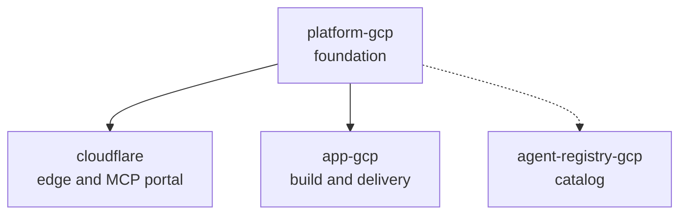
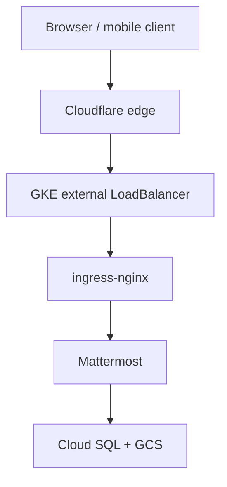
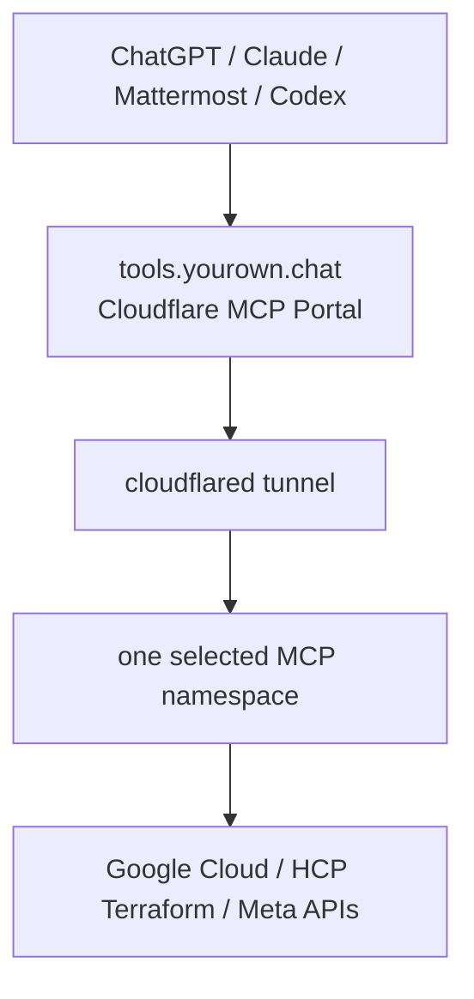
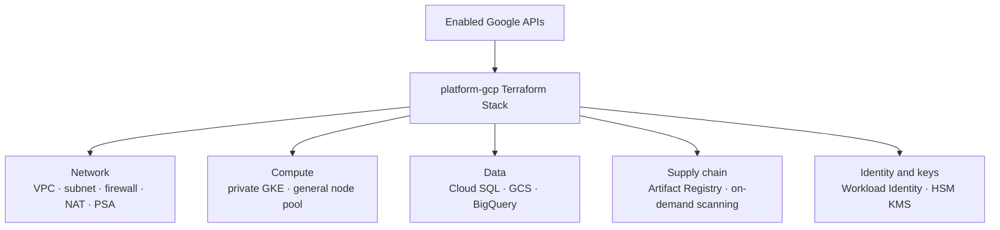
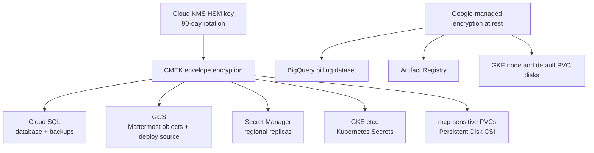
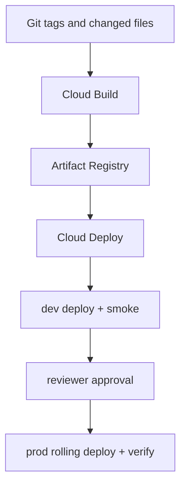
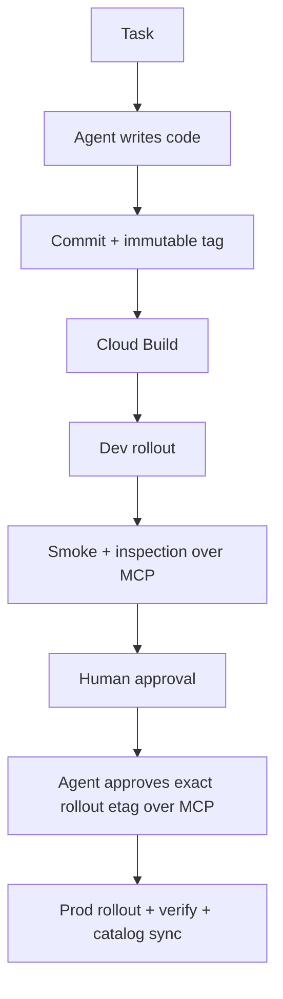
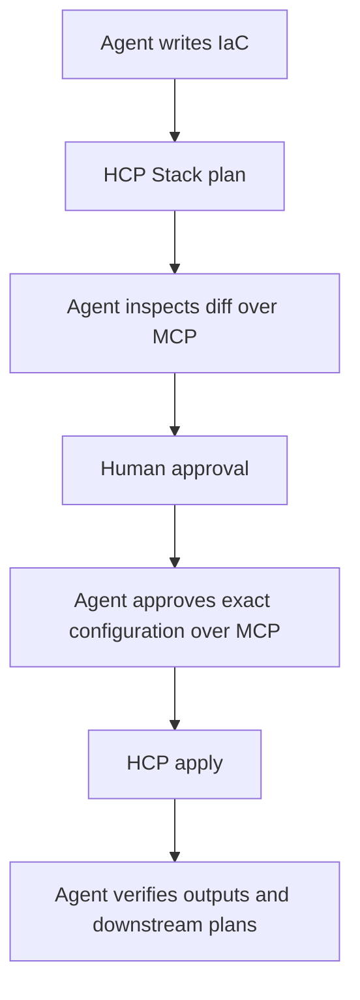
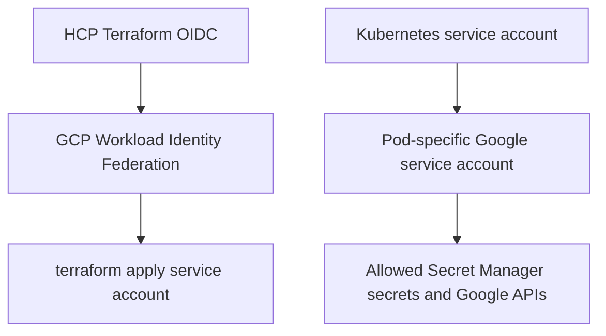

# YourOwn.Chat

A self-hosted Mattermost chat platform on Google Cloud, fronted by Cloudflare,
managed end-to-end with **HCP Terraform Stacks** — production practices on a
~$100/month budget.

**[Русская версия → README.ru.md](README.ru.md)**

---

## What's inside

Runtime infrastructure lives in the `yourown-chat` GCP project, with one
isolated legacy FinOps project for the former billing account. Four Terraform
Stacks (three data-linked plus one independent governance catalog) own the
platform with separate state and blast radius:

| Stack | Directory | What it owns | Changes |
|---|---|---|---|
| **platform-gcp** | `terraform/platform-gcp` | The stateful foundation: APIs, network + reserved ingress IP, CMEK key, GKE cluster, Cloud SQL, object storage, container registry, active billing dataset, isolated legacy billing project/dataset, Workload Identity SAs | Rarely |
| **cloudflare** | `terraform/cloudflare` | The public edge for `yourown.chat`: DNS, TLS/security settings, DNSSEC, WAF, Origin CA cert + the origin-TLS secrets it fills | Sometimes |
| **app-gcp** | `terraform/app-gcp` | App secrets; independent Mattermost and MCP delivery pipelines; persistent dev PostgreSQL; image CI; tag routing; cluster bootstrap | Often |
| **agent-registry-gcp** | `terraform/agent-registry-gcp` | Google Cloud Agent Registry catalog entries for external APIs and vendor-hosted MCP servers; GKE and Google MCPs register automatically | Rarely |

The platform stack **publishes** its key values (ingress IP, cluster ID,
registry coordinates, CMEK key, Workload Identity members); **cloudflare** and
**app-gcp** consume them over HCP's linked-stacks mechanism. Nothing is
copy-pasted between stacks, and when a platform apply changes a published
value, HCP automatically triggers the downstream plans. The small architecture
views below show each path without mixing state, traffic and delivery arrows.

Why split? A mistake in edge rules or CI can now never touch the state that
holds the VPC, the cluster and the database — and the Cloudflare API token
(the only static secret in the whole setup) lives alone in its own stack.

### Capabilities at a glance

| Capability | How |
|---|---|
| PostgreSQL | Cloud SQL, private IP only, Frankfurt (`europe-west3`), PITR + 7-day backups |
| Object storage | GCS bucket with S3-compatible HMAC creds for Mattermost ("filestore") |
| Kubernetes | One zonal GKE Standard cluster, private nodes, one autoscaling `general` pool (`e2-standard-2`, 1–3 nodes) |
| Container registry | One Artifact Registry repo (`docker`) with a shared hardened runtime base; paid Artifact Analysis scanning is off by default and opened through a guarded MCP action only for selected build windows |
| CI | Cloud Build builds Mattermost on a `v*-patched` tag; one catalog-driven MCP builder creates shared OS/language bases and mirrors pinned vendor images into Artifact Registry |
| CD | Separate Mattermost and MCP pipelines; ephemeral test workloads; one semver platform tag routes only changed components |
| Agent-operated delivery | An agent can author a change, inspect CI/CD and Terraform plans, promote a verified release, and request the guarded production approval through MCP; write actions remain Human-in-the-loop |
| Secrets | Everything in Secret Manager, mounted via the CSI add-on + Workload Identity |
| Encryption | One shared Cloud KMS **HSM** key (CMEK, 90-day rotation) over Cloud SQL, GCS, Secret Manager and **GKE etcd** (application-layer Kubernetes Secrets encryption) |
| Edge | Cloudflare proxy: Full (Strict) TLS, DNSSEC, HSTS, www→apex redirect, Origin CA cert issued by Terraform |
| Cost visibility | Billing profile, budgets and Active Assist through MCP; EU BigQuery Detailed Billing Export dataset with GKE cost allocation and a 1 GB/query ceiling |

> GCP has no "S3" — its equivalent is a Cloud Storage (GCS) bucket, which is
> what this platform provisions, in the same German region.

---

## Google Cloud Initial Setup

One-time, out-of-band bootstrap that the Terraform stacks depend on. Run it
once; afterwards the four stacks provision everything else themselves.

What this section does:

- enables the **bootstrap** APIs (auth + Service Usage + Secret Manager) so
  Terraform can enable the rest itself;
- creates the Workload Identity Pool and OIDC Provider;
- creates the `plan` / `apply` service accounts, impersonation bindings and
  project IAM roles;
- authorizes the shared Cloud Build GitHub connection (`pilprod-github`);
- creates the Cloudflare API token (the only static secret — Cloudflare has no
  Workload Identity path);
- creates the three linked Stacks plus the independent Agent Registry catalog
  Stack in HCP Terraform.

### Auth flow

```
HCP Terraform run
   -> mints OIDC JWT   (identity_token "gcp", aud = full WIF provider URL)
   -> WIF provider     (issuer app.terraform.io, verifies org + project)
   -> STS token exchange
   -> impersonates the least-privilege apply SA
   -> short-lived access token
   -> google provider (external_credentials) -> Google Cloud APIs
```

The Terraform side is already wired: the `identity_token "gcp"` blocks and
deployments in `platform.tfdeploy.hcl` / `app.tfdeploy.hcl` /
`cloudflare.tfdeploy.hcl` carry the real `audience` and
`service_account_email` — no placeholders to fill.

### Input values

| Variable | Value |
| --- | --- |
| `PROJECT_ID` | `yourown-chat` |
| `TFC_ORG` | `papou-work` |
| `TFC_PROJECT` | `yourown-chat` |
| `WIF_POOL_ID` | `hcp-terraform` |
| `WIF_PROVIDER_ID` | `hcp-terraform` |
| `PLAN_SA` | `terraform-plan` |
| `APPLY_SA` | `terraform-apply` |

### 1. Initialize environment

```sh
export PROJECT_ID="yourown-chat"
export PROJECT_NUMBER="$(gcloud projects describe "$PROJECT_ID" --format='value(projectNumber)')"

export TFC_ORG="papou-work"
export TFC_PROJECT="yourown-chat"

export WIF_POOL_ID="hcp-terraform"
export WIF_PROVIDER_ID="hcp-terraform"

export PLAN_SA="terraform-plan"
export APPLY_SA="terraform-apply"
```

### 2. Enable the bootstrap APIs

Only the APIs Terraform needs *before* it can authenticate, plus Secret
Manager. Every other API is enabled by the platform stack's
`project_services` component — this list is the single source of truth for
manual enablement.

```sh
gcloud services enable \
  cloudresourcemanager.googleapis.com \
  serviceusage.googleapis.com \
  iam.googleapis.com \
  iamcredentials.googleapis.com \
  sts.googleapis.com \
  secretmanager.googleapis.com \
  --project="$PROJECT_ID"
```

### 3. Create the Workload Identity Pool

```sh
gcloud iam workload-identity-pools create "$WIF_POOL_ID" \
  --project="$PROJECT_ID" \
  --location="global" \
  --display-name="HCP Terraform"
```

### 4. Create the OIDC Provider for HCP Terraform

```sh
gcloud iam workload-identity-pools providers create-oidc "$WIF_PROVIDER_ID" \
  --project="$PROJECT_ID" \
  --location="global" \
  --workload-identity-pool="$WIF_POOL_ID" \
  --display-name="HCP Terraform OIDC" \
  --issuer-uri="https://app.terraform.io" \
  --allowed-audiences="https://iam.googleapis.com/projects/$PROJECT_NUMBER/locations/global/workloadIdentityPools/$WIF_POOL_ID/providers/$WIF_PROVIDER_ID" \
  --attribute-mapping="google.subject=assertion.sub,attribute.terraform_organization_name=assertion.terraform_organization_name,attribute.terraform_project_name=assertion.terraform_project_name,attribute.terraform_stack_name=assertion.terraform_stack_name,attribute.terraform_run_phase=assertion.terraform_run_phase" \
  --attribute-condition="assertion.terraform_organization_name=='papou-work' && assertion.terraform_project_name=='yourown-chat'"
```

### 5. Create the service accounts

```sh
gcloud iam service-accounts create "$PLAN_SA" \
  --project="$PROJECT_ID" \
  --display-name="HCP Terraform Plan"

gcloud iam service-accounts create "$APPLY_SA" \
  --project="$PROJECT_ID" \
  --display-name="HCP Terraform Apply"
```

### 6. Allow HCP Terraform impersonation

```sh
export WIF_PRINCIPAL_SET="principalSet://iam.googleapis.com/projects/$PROJECT_NUMBER/locations/global/workloadIdentityPools/$WIF_POOL_ID/attribute.terraform_organization_name/$TFC_ORG"

gcloud iam service-accounts add-iam-policy-binding \
  "$PLAN_SA@$PROJECT_ID.iam.gserviceaccount.com" \
  --project="$PROJECT_ID" \
  --role="roles/iam.workloadIdentityUser" \
  --member="$WIF_PRINCIPAL_SET"

gcloud iam service-accounts add-iam-policy-binding \
  "$APPLY_SA@$PROJECT_ID.iam.gserviceaccount.com" \
  --project="$PROJECT_ID" \
  --role="roles/iam.workloadIdentityUser" \
  --member="$WIF_PRINCIPAL_SET"
```

### 7. Grant project IAM roles

Plan SA — read-only:

```sh
gcloud projects add-iam-policy-binding "$PROJECT_ID" \
  --member="serviceAccount:$PLAN_SA@$PROJECT_ID.iam.gserviceaccount.com" \
  --role="roles/viewer"

gcloud projects add-iam-policy-binding "$PROJECT_ID" \
  --member="serviceAccount:$PLAN_SA@$PROJECT_ID.iam.gserviceaccount.com" \
  --role="roles/browser"
```

Apply SA — everything the stacks create (single source of truth):

```sh
export APPLY="serviceAccount:$APPLY_SA@$PROJECT_ID.iam.gserviceaccount.com"

for ROLE in \
  roles/serviceusage.serviceUsageAdmin \
  roles/resourcemanager.projectIamAdmin \
  roles/iam.serviceAccountAdmin \
  roles/iam.serviceAccountUser \
  roles/secretmanager.admin \
  roles/container.admin \
  roles/compute.networkAdmin \
  roles/compute.securityAdmin \
  roles/cloudkms.admin \
  roles/cloudsql.admin \
  roles/storage.admin \
  roles/clouddeploy.admin \
  roles/artifactregistry.admin \
  roles/agentregistry.editor \
  roles/cloudbuild.connectionAdmin \
  roles/cloudbuild.builds.editor ; do
  gcloud projects add-iam-policy-binding "$PROJECT_ID" \
    --member="$APPLY" --role="$ROLE" --condition=None
done
```

### Cloud Billing account access and export

Cloud Billing account IAM is outside project IAM. The active USD billing
account is `01B729-537989-CCA4BB`; the Payments account nickname is
`YourOwn.Chat · USD · Argentina`. The nickname is only a Payments UI label and
does not change the Cloud Billing account `displayName` returned by the API.

Grant only the production Google Cloud MCP identity read-only account access;
`terraform-apply` needs project/dataset permissions but does not need
`roles/billing.admin`:

```sh
export BILLING_ACCOUNT_ID="01B729-537989-CCA4BB"

gcloud billing accounts add-iam-policy-binding "$BILLING_ACCOUNT_ID" \
  --member="serviceAccount:mcp-servers@yourown-chat.iam.gserviceaccount.com" \
  --role="roles/billing.viewer"

gcloud billing accounts describe "$BILLING_ACCOUNT_ID" \
  --format="yaml(name,displayName,currencyCode,open)"

gcloud billing projects describe yourown-chat \
  --format="yaml(projectId,billingAccountName,billingEnabled)"

gcloud billing accounts get-iam-policy "$BILLING_ACCOUNT_ID" \
  --flatten="bindings[].members" \
  --filter="bindings.members:mcp-servers@yourown-chat.iam.gserviceaccount.com" \
  --format="table(bindings.role,bindings.members)"
```

The important verification values are:

```yaml
currencyCode: USD
name: billingAccounts/01B729-537989-CCA4BB
open: true
---
billingAccountName: billingAccounts/01B729-537989-CCA4BB
billingEnabled: true
projectId: yourown-chat
```

`displayName` can remain `Argentina`; it is independent of the Payments
account nickname.

#### Billing health checks

The active USD account has a Terraform-managed **USD 100 monthly budget**:

- actual-spend email thresholds: 50%, 75%, 90% and 100%;
- forecasted-spend email threshold: 100%;
- scope: the complete billing account;
- credits are included, so the tracked amount follows expected payable spend;
- default email recipients remain enabled for human Billing Account
  Administrators and Billing Account Users;
- `prevent_destroy` protects the budget from accidental removal.

`terraform-apply` holds only `roles/billing.costsManager` on this account. It
can maintain budgets but cannot change payment settings or account IAM. The
one-time bootstrap is:

```sh
gcloud billing accounts add-iam-policy-binding 01B729-537989-CCA4BB \
  --member="serviceAccount:terraform-apply@yourown-chat.iam.gserviceaccount.com" \
  --role="roles/billing.costsManager"
```

The remaining Billing health recommendations are deliberately split between
IaC and one-time identity governance:

| Health recommendation | Implementation |
|---|---|
| Set up budget alerts | Terraform component `billing_budget` owns the USD 100 monthly budget and five thresholds |
| Grant access to billing reports | `user:ilya@papou.email` and the read-only MCP identity have `roles/billing.viewer` |
| Assign multiple Billing Account Administrators | Requires a second real human identity; do not satisfy this by granting a service account Billing Admin |
| Turn off Billing Account Creator for domain | Removed once from `domain:papou.work`; Terraform is intentionally not granted organization IAM administration |
| Link a project or close unused account | Active account is linked to `yourown-chat`; the former account is linked to `yourown-chat-billing-legacy` until export catch-up finishes |

To add the required backup administrator after choosing the person:

```sh
export BACKUP_BILLING_ADMIN="second-admin@papou.work"

gcloud billing accounts add-iam-policy-binding 01B729-537989-CCA4BB \
  --member="user:$BACKUP_BILLING_ADMIN" \
  --role="roles/billing.admin"

gcloud billing accounts add-iam-policy-binding 01B729-537989-CCA4BB \
  --member="user:$BACKUP_BILLING_ADMIN" \
  --role="roles/billing.viewer"
```

Do not put billing-account or organization IAM bindings into `platform-gcp`:
Terraform would need persistent Billing Admin or Organization Admin power to
manage its own access. The project infrastructure and budget are declarative;
the small bootstrap trust set remains an audited one-time operation.

Billing-related identities have deliberately different scopes:

| Identity | Scope | Purpose |
|---|---|---|
| `mcp-servers@yourown-chat.iam.gserviceaccount.com` | Billing account `roles/billing.viewer`; project `roles/bigquery.jobUser`; dataset `roles/bigquery.dataViewer` | Read billing profile/budgets and execute bounded, read-only cost queries |
| `terraform-apply@yourown-chat.iam.gserviceaccount.com` | Project `roles/bigquery.user` | Create and manage the `billing` dataset; it has no Billing Account Admin grant |
| `billing-export-bigquery@system.gserviceaccount.com` | Dataset owner, added automatically by Google | Create and continuously fill the managed export table; do not remove this binding |

#### Detailed cost history for both billing accounts

Enable the active export under billing account `01B729-537989-CCA4BB`:

1. Open **Billing → Billing export → BigQuery export**.
2. Under **Detailed usage cost**, select **Edit settings** or **Enable**.
3. Select project `yourown-chat`, dataset `billing`, and save.
4. Wait for
   `yourown-chat.billing.gcp_billing_export_resource_v1_01B729_537989_CCA4BB`.

Keep the legacy account `01E41D-B879C6-3494D7` separate. Google requires the
project that contains an export dataset to be linked to the same billing
account as the exported data, while one project can be linked to only one
billing account. The dedicated setup is described in
[Provision the legacy billing archive](#8-provision-the-legacy-billing-archive).
After `platform-gcp` creates the project and dataset:

1. Keep the legacy billing account open until export catch-up and late
   adjustments have completed.
2. In the legacy account's **Billing export** page enable **Detailed usage
   cost** for that project and dataset.
3. Wait for
   `yourown-chat-billing-legacy.billing.gcp_billing_export_resource_v1_01E41D_B879C6_3494D7`.
4. Verify that the Terraform-managed MCP dataset reader is present. Query jobs
   continue to run in `yourown-chat`, where the identity already has
   `roles/bigquery.jobUser`.

For an EU multi-region dataset, the first Detailed export normally backfills
from the beginning of the previous month and can take up to five days to catch
up. It does not reconstruct older periods. Keep the two Google-managed tables
unchanged and combine them through a view or `UNION ALL`; do not copy legacy
rows into the active export table. The current MCP production configuration
queries the active USD table only. The legacy table is retained independently
until the cost adapter is explicitly configured for a union view.

#### Which Billing export options to enable

| Export | What it contains | Decision for this stack |
|---|---|---|
| **Detailed usage cost** | Everything in Standard plus resource-level cost attribution for resources such as VMs, disks and GKE workloads | **Enable for both accounts.** This is the source used by `billing_analyze_costs` |
| **Standard usage cost** | Account, invoice, service, SKU, project, labels, location, usage, cost, credits and currency, but no resource-level attribution | Optional and redundant for the current MCP because Detailed is a superset |
| **Pricing data** | The billing account's daily SKU prices, tiers, consumption models and effective dates | Enable on the active account if forecasting or list-price-versus-effective-price analysis is needed; it is not retroactive and can take up to 48 hours initially |
| **CUD metadata** (Preview) | Daily snapshots of spend-based committed-use subscriptions and entitlement metadata | Leave disabled until the account buys CUDs or commitment coverage analysis is required |
| **FOCUS usage cost** (Preview) | A normalized FinOps Open Cost and Usage Specification table in a Google-managed immutable dataset | Optional; useful later for cross-cloud AWS/GCP reporting, but not a replacement for Detailed resource analysis |

Enabling Standard in addition to Detailed does not give the MCP more data.
Pricing export requires BigQuery Data Transfer Service and stronger one-time
setup permissions; that API is already enabled by `platform-gcp`. See Google's
[Billing export setup](https://docs.cloud.google.com/billing/docs/how-to/export-data-bigquery-setup)
and [Billing table reference](https://docs.cloud.google.com/billing/docs/how-to/export-data-bigquery-tables)
for the current schemas and availability rules.

Why each role, in one line each:

| Role | Grants |
|---|---|
| `serviceusage.serviceUsageAdmin` | the stack enables its own APIs |
| `resourcemanager.projectIamAdmin` | project-level IAM bindings (node SA reader, build SA log writer…) |
| `iam.serviceAccountAdmin` + `serviceAccountUser` | create the per-tenant/build SAs and `actAs` them |
| `secretmanager.admin` | create secrets + grant tenants `secretAccessor` |
| `container.admin` | GKE cluster + node pools |
| `compute.networkAdmin` + `securityAdmin` | VPC/NAT/PSA/IP + firewall rules (create/update lives in `securityAdmin`) |
| `cloudkms.admin` | CMEK key ring/key + service-agent grants |
| `cloudsql.admin` | private Postgres instance + DB + user |
| `storage.admin` | GCS bucket + HMAC keys |
| `clouddeploy.admin` | pipeline + targets + execution SA binding |
| `artifactregistry.admin` | the `docker` repo + build SA writer grant |
| custom `artifactScanningController` | MCP can only read repository state and toggle its vulnerability-scanning gate; it cannot delete repositories or images |
| `agentregistry.editor` | register and maintain external endpoints and vendor-hosted MCP metadata |
| `cloudbuild.connectionAdmin` + `builds.editor` | repository links + tag triggers on the shared connection |

> Start broad to keep the first apply unblocked without granting Owner/Editor;
> tighten later with resource-scoped conditions once names stabilize.

Verify:

```sh
gcloud projects get-iam-policy "$PROJECT_ID" \
  --flatten="bindings[].members" \
  --filter="bindings.members:terraform-plan OR bindings.members:terraform-apply" \
  --format="table(bindings.role, bindings.members)"
```

### 8. Provision the legacy billing archive

The project moved from the former THB billing account
`01E41D-B879C6-3494D7` to the active USD account
`01B729-537989-CCA4BB`. Google requires an export dataset's project to be
linked to the account being exported. We bootstrap a second, non-networked
FinOps project once; `platform-gcp` owns its API, dataset and reader access:

| Resource | Value |
|---|---|
| Organization | `papou.work` (`374501806996`) |
| Project | `yourown-chat-billing-legacy` |
| Billing account | `01E41D-B879C6-3494D7` |
| Dataset | `billing`, EU multi-region, no table expiration |
| Expected table | `gcp_billing_export_resource_v1_01E41D_B879C6_3494D7` |
| Reader | `mcp-servers@yourown-chat.iam.gserviceaccount.com` |

Create and link the empty archive project once with your billing-owner
identity. This avoids giving the Terraform service account organization-wide
Project Creator:

```sh
export ORGANIZATION_ID="374501806996"
export LEGACY_BILLING_ACCOUNT_ID="01E41D-B879C6-3494D7"
export APPLY_SA="terraform-apply@yourown-chat.iam.gserviceaccount.com"

gcloud projects create yourown-chat-billing-legacy \
  --name="YourOwn Chat legacy billing" \
  --organization="$ORGANIZATION_ID" \
  --no-enable-cloud-apis

gcloud billing projects link yourown-chat-billing-legacy \
  --billing-account="$LEGACY_BILLING_ACCOUNT_ID"

for ROLE in \
  roles/serviceusage.serviceUsageAdmin \
  roles/bigquery.admin; do
  gcloud projects add-iam-policy-binding yourown-chat-billing-legacy \
    --member="serviceAccount:$APPLY_SA" \
    --role="$ROLE" \
    --condition=None
done
```

Apply `platform-gcp`. Terraform enables BigQuery, creates the EU dataset with
`delete_contents_on_destroy = false`, and grants the MCP dataset read access.
Terraform has no organization-wide role and no permission to relink or close
either billing account.

One console action remains because Google exposes no public Terraform or
`gcloud` operation for this setting: select the **legacy billing account**,
then **Billing → Billing export → BigQuery export → Detailed usage cost →
Enable**, project `yourown-chat-billing-legacy`, dataset `billing`.

Do not enable Standard solely for this archive: Detailed is its resource-level
superset. With the EU multi-region, the initial export normally backfills from
the beginning of the previous month and can take up to five days. Keep the old
account open until catch-up and late adjustments finish.

### 9. Create the Cloud Build GitHub connection

Two repos feed CI/CD: `pilprod/mattermost` (image source) and
`pilprod/yourown-chat` (this repo, holds `helm/`). Both link to **one** shared
2nd-gen connection you authorize **once in the console** — Terraform then
attaches the repository links and triggers to it, but never owns the
connection itself.

> **Why console OAuth, not a PAT?** The PAT path is brittle: the token must
> itself have access to the GitHub App installation, or Cloud Build rejects it
> ("the user token does not have access to installations"). The console's
> *Authorize* button runs the OAuth flow and stores the token for you — the
> reliable, Google-blessed path. No PAT, no Secret Manager secret, no
> installation-ID variable.

1. Console → **Cloud Build → Repositories (2nd gen) → Create host connection**;
   GitHub, region `europe-west3` (must match the stack region).
2. Name it **`pilprod-github`**, click **Authorize**, grant the *Google Cloud
   Build* GitHub App access to **both** repos.
3. Skip the optional CMEK encryption prompt; click **Connect**.

Don't link the repositories by hand — Terraform does that on apply. The
connection name is a stack input (`github_connection_name`, default
`pilprod-github`).

To rotate or re-scope access later, re-authorize the App from the console or
GitHub settings — the connection keeps its name and ID, so Terraform doesn't
change. If you ever recreate it, reuse the same name.

### 10. Create the four Stacks in HCP Terraform

All four live in the **same HCP project** and connect to this repo — only the
working directory differs. Names used by `upstream_input` must match
**exactly** (`app.terraform.io/papou-work/yourown-chat/<stack name>`):

| Stack name | Working directory | Consumes |
|---|---|---|
| `platform-gcp` | `terraform/platform-gcp` | — |
| `cloudflare` | `terraform/cloudflare` | `platform-gcp` |
| `app-gcp` | `terraform/app-gcp` | `platform-gcp` (not cloudflare) |
| `agent-registry-gcp` | `terraform/agent-registry-gcp` | — (apply after `platform-gcp` enables the API) |

If the catalog Stack already exists under the old `agent-registry` name, keep
its state: in HCP Terraform open **Stack → Settings**, change the name to
`agent-registry-gcp`, change the working directory to
`terraform/agent-registry-gcp`, and save. Do not create a replacement Stack.

Then:

1. Attach the Cloudflare variable set (step 11) to the **cloudflare** stack.
2. Plan + apply **platform-gcp** first. The first plan proves federation end to
   end — if the token is rejected, re-check the provider's
   `--attribute-condition` and `--allowed-audiences` against the
   `identity_token` block.
3. Once it applies, its published values unlock the **cloudflare** and
   **app-gcp** plans (HCP triggers them automatically; order between the two
   doesn't matter).
4. Apply **agent-registry-gcp**. It is intentionally independent because its
   catalog contains stable public interfaces, but the Agent Registry API must
   already be enabled by **platform-gcp**.

> Migrating from an older single-stack layout: create the four stacks, then
> delete the old one. State doesn't carry over — with a torn-down environment
> everything creates fresh; with live infrastructure you'd need state moves.

### 11. Create the Cloudflare API token

The cloudflare stack manages the `yourown.chat` zone. Cloudflare has no
Workload Identity path, so its API credential is a static secret.
`cloudflare_api_token` is used ephemerally by the provider. Cloud Deploy reads
the same credential from the CMEK-encrypted
`cloudflare-mcp-capability-sync` Secret Manager secret only for a controlled
capability-sync recovery. Routine rollouts rely on Cloudflare's background
catalog refresh and do not mutate shared Portal state. Payload versions stay
outside Terraform state; Terraform manages the secret metadata and IAM only.

#### 11.1 Scope the token

Cloudflare dashboard → **My Profile → API Tokens → Create Token → Create
Custom Token**, scoped to the `yourown.chat` zone and, for Zero Trust, the
owning Cloudflare account:

| Permission | Access | Needed for |
|---|---|---|
| Zone → Zone | Read | resolving the zone ID (always) |
| Zone → DNS | Edit | A/CNAME/CAA records + DNSSEC (always) |
| Zone → Zone Settings | Edit | SSL mode, HSTS, TLS versions (always) |
| Zone → Single Redirect | Edit | the www→apex redirect (default on) |
| Zone → SSL and Certificates | Edit | issuing the Origin CA cert (default on) |
| Zone → Zone WAF | Edit | only if you enable WAF/rate-limit rules |
| Account → Cloudflare Tunnel | Edit | only if `zero_trust_enabled = true` (the tunnel) |
| Account → Access: Apps and Policies | Edit | only if `zero_trust_enabled = true` (Access apps/policies) |
| Account → Access: Service Tokens | Edit | only if `zero_trust_enabled = true` (AI Controls → protected MCP upstreams) |
| Account → Access: Organizations, Identity Providers, and Groups | Edit | only if `zero_trust_enabled = true` (read/update the Zero Trust team name and domain) |
| Account → MCP Portals | Edit | only if `zero_trust_enabled = true` (AI Controls MCP servers and Portal) |

**Zone Resources**: `Include → Specific zone → yourown.chat`.
**Account Resources** (only for the five Zero Trust rows above): `Include →
Specific account → your account`. Without these ACCOUNT-scoped permissions the
Zero Trust resources fail with **error 10000 (Authentication error)** or
**failed to read Access Organization state** — tunnels, Access apps, and the
organization/team settings and MCP Portal catalog are account-level, not
zone-level.

If the token predates Zero Trust or MCP Portal management, edit it to add all
four account permissions. If you create or roll the token instead, replace
`cloudflare_api_token` in the HCP variable set before retrying the plan; HCP
does not learn a newly generated token secret automatically.

**Do not IP-filter the token** for HCP-managed runs: plan/apply execute from
dynamic AWS egress IPs that are *not* in HCP's published ranges, so an
allowlist breaks the provider with error 9109. Rely on zone scoping + a TTL
(e.g. 90 days) instead. IP filtering only makes sense on a self-hosted agent
with a fixed NAT egress.

#### 10.2 Store it in an HCP variable set

> **Varsets carry secrets only.** Terraform Stacks treats every `store` value
> as *ephemeral* — fine for this token (read by an `ephemeral` variable),
> rejected for anything that must persist into a plan. Operational toggles are
> committed literals in the `.tfdeploy.hcl` files.

1. Create a variable set, apply it to the **cloudflare** stack.
2. Add a Terraform variable `cloudflare_api_token` = the token. Tick
   **Sensitive**, leave **HCL** unchecked.
3. Put the variable set's ID into the `store "varset"` block in
   `terraform/cloudflare/cloudflare.tfdeploy.hcl`.

#### 10.3 Rotating

Update `cloudflare_api_token` in the varset, then add a new JSON payload version
to the `cloudflare-mcp-capability-sync` Secret Manager secret. The JSON keys
are `account_id`, `api_token`, and `server_ids`; payload versions deliberately
remain outside Terraform because HCP Terraform Stacks currently fails while
recording an ephemeral component input after `secret_data_wo` succeeds.

#### 10.4 Origin TLS

With `cloudflare_manage_origin_cert = true` (default) the stack issues the
Origin CA cert and fills the `mattermost-origin-tls-*` secrets itself —
nothing manual. Authenticated Origin Pulls are off by default; the ingress
runbook ([`helm/ingress-nginx/README.md`](helm/ingress-nginx/README.md))
covers enabling them.

### Notes

- One `terraform-apply@` SA currently backs both plan and apply phases; the
  separate `terraform-plan` SA exists for a stricter split later.
- Rotating WIF trust = delete/recreate the provider. There are no keys.

## How the pieces fit

The architecture is intentionally shown as several small views. Each diagram
answers one question and keeps arrows flowing in one direction.

### Stack ownership and state


```mermaid
flowchart TB
  P["platform-gcp<br/>foundation"] --> E["cloudflare<br/>edge and MCP portal"]
  P --> D["app-gcp<br/>build and delivery"]
  P -.-> R["agent-registry-gcp<br/>catalog"]
```

`platform-gcp` is the only upstream state. `cloudflare` and `app-gcp` consume
published values; they never publish values back to the platform and therefore
cannot form a dependency cycle.

### Public application traffic


```mermaid
flowchart TB
  U["Browser / mobile client"] --> C["Cloudflare edge"]
  C --> L["GKE external LoadBalancer"]
  L --> I["ingress-nginx"]
  I --> M["Mattermost"]
  M --> S["Cloud SQL + GCS"]
```

Only Cloudflare addresses may reach ingress-nginx. Cloud SQL has no public IP;
Mattermost reaches it over Private Service Access and stores files in GCS.

### MCP client traffic


```mermaid
flowchart TB
  A["ChatGPT / Claude / Mattermost / Codex"] --> P["tools.yourown.chat<br/>Cloudflare MCP Portal"]
  P --> T["cloudflared tunnel"]
  T --> X["one selected MCP namespace"]
  X --> G["Google Cloud / HCP Terraform / Meta APIs"]
```

The portal is the single public MCP endpoint. Each MCP server and the tunnel
have separate namespaces, service accounts, secrets and default-deny network
policies. A server cannot connect directly to another MCP namespace.

### Google Cloud foundation


```mermaid
flowchart TB
  API["Enabled Google APIs"] --> TF["platform-gcp Terraform Stack"]
  TF --> N["Network<br/>VPC · subnet · firewall · NAT · PSA"]
  TF --> C["Compute<br/>private GKE · general node pool"]
  TF --> D["Data<br/>Cloud SQL · GCS · BigQuery"]
  TF --> S["Supply chain<br/>Artifact Registry · on-demand scanning"]
  TF --> I["Identity and keys<br/>Workload Identity · HSM KMS"]
```

This view shows ownership only: every arrow means “created by the
`platform-gcp` Stack”. Encryption is a separate relationship and is shown
below, so resource-ownership and key-use arrows do not cross.


```mermaid
flowchart TB
  K["Cloud KMS HSM key<br/>90-day rotation"] --> E["CMEK envelope encryption"]
  E --> SQL["Cloud SQL<br/>database + backups"]
  E --> GCS["GCS<br/>Mattermost objects + deploy source"]
  E --> SM["Secret Manager<br/>regional replicas"]
  E --> ETCD["GKE etcd<br/>Kubernetes Secrets"]
  E --> PVC["mcp-sensitive PVCs<br/>Persistent Disk CSI"]

  GM["Google-managed encryption at rest"] --> BQ["BigQuery billing dataset"]
  GM --> AR["Artifact Registry"]
  GM --> ND["GKE node and default PVC disks"]
```

The billing dataset is separate from application data and gives the Google
Cloud MCP read-only cost visibility. Google-managed encryption is still
encryption at rest, but those services are deliberately not presented as
CMEK-controlled in this configuration. Node boot disks hold the Container
Optimized OS and disposable pod/runtime data; the ordinary PVCs currently hold
only replaceable dev Mattermost and dev PostgreSQL data. Production Mattermost
state is in CMEK-protected Cloud SQL and GCS, Kubernetes Secrets are
application-layer encrypted with CMEK before etcd persistence, and the only
stateful MCP session uses the `mcp-sensitive` CMEK StorageClass.

### Build and release flow


```mermaid
flowchart TB
  G["Git tags and changed files"] --> B["Cloud Build"]
  B --> R["Artifact Registry"]
  R --> D["Cloud Deploy"]
  D --> V["dev deploy + smoke"]
  V --> A["reviewer approval"]
  A --> P["prod rolling deploy + verify"]
```

Mattermost and MCP use independent pipelines. Change routing starts only the
affected pipeline; production approval happens after the dev smoke succeeds.

### Agent-operated delivery and infrastructure

The connected MCP Portal is also the agent's guarded control plane. It exposes
read tools for Git-adjacent delivery evidence, Cloud Build, Cloud Deploy,
Artifact Analysis, Google Cloud operations and HCP Terraform Stacks, plus
separately classified write tools for promotion, approval and Stack changes.
An agent can therefore take a task from code to production without receiving a
long-lived cloud key or falling back to local `gcloud`, `kubectl` or a broad
Terraform token.

Application delivery follows one straight, auditable path:


```mermaid
flowchart TB
  T["Task"] --> C["Agent writes code"]
  C --> G["Commit + immutable tag"]
  G --> B["Cloud Build"]
  B --> D["Dev rollout"]
  D --> S["Smoke + inspection over MCP"]
  S --> H["Human approval"]
  H --> P["Agent approves exact rollout etag over MCP"]
  P --> R["Prod rollout + verify + catalog sync"]
```

Infrastructure changes use the same pattern with the Terraform control plane:


```mermaid
flowchart TB
  C["Agent writes IaC"] --> P["HCP Stack plan"]
  P --> I["Agent inspects diff over MCP"]
  I --> H["Human approval"]
  H --> A["Agent approves exact configuration over MCP"]
  A --> R["HCP apply"]
  R --> V["Agent verifies outputs and downstream plans"]
```

Human-in-the-loop is enforced at multiple layers rather than being a chat
convention:

- read-only MCP tools may inspect plans, builds, vulnerabilities, rollouts and
  logs without mutating infrastructure;
- write/delete tools require explicit client approval and use narrow
  allowlists;
- Cloud Deploy approval requires a fresh rollout inspection and its exact
  current `etag`;
- Terraform Stack approval requires the inspected deployment run and exact
  configuration ID;
- promotion and rollback are plan-then-execute operations bound to an exact
  plan hash;
- Cloud Deploy and HCP keep the durable actor, plan, approval and execution
  history, while Mattermost is the planned human discussion/approval surface.

Today a human starts or confirms the guarded write action. The target agent
platform in [`docs/AGENT_PLATFORM.md`](docs/AGENT_PLATFORM.md) will pause a
Temporal workflow, collect Approve/Edit/Reject in the linked Mattermost thread,
and resume the same workflow with the human identity and decision attached.

### Identity and secrets


```mermaid
flowchart TB
  H["HCP Terraform OIDC"] --> W["GCP Workload Identity Federation"]
  W --> F["terraform apply service account"]
  K["Kubernetes service account"] --> P["Pod-specific Google service account"]
  P --> S["Allowed Secret Manager secrets and Google APIs"]
```

There are no Google service-account keys. Terraform receives a short-lived
token through WIF; pods use Workload Identity and can read only the secrets and
APIs assigned to their tenant.

### Resource inventory

This is the deployable inventory, grouped by owner rather than by Terraform
resource type.

| Owner | Resources |
|---|---|
| **platform-gcp / APIs** | Service Usage entries for Compute, GKE, Service Networking, Cloud SQL, KMS, Storage, Cloud Deploy, Logging, Monitoring, Cloud Build, Cloud Billing, Billing Budgets, BigQuery, BigQuery Data Transfer, Recommender, Artifact Registry, Artifact Analysis, Agent Registry and Google Workspace MCP APIs |
| **platform-gcp / network** | Custom VPC, regional subnet with pod/service secondary ranges, internal firewall, Cloud Router, Cloud NAT, reserved external ingress IP, PSA address and Service Networking connection |
| **platform-gcp / encryption** | Regional HSM KMS key ring and key, rotation policy, IAM grants for GKE, Cloud SQL, GCS and Secret Manager service agents |
| **platform-gcp / compute** | One zonal private GKE Standard cluster, autoscaling `general` node pool, shielded nodes, node service account, CSI drivers, etcd application-layer encryption and GKE cost allocation |
| **platform-gcp / data** | Private Cloud SQL PostgreSQL instance, database/user/password secrets, GCS Mattermost bucket, HMAC service account and secrets, EU BigQuery `billing` dataset |
| **platform-gcp / supply chain** | Regional Artifact Registry `docker` repository, cleanup policy, default-off scanning gate and least-privilege MCP scanning controller |
| **platform-gcp / identities** | Separate Google service accounts and Workload Identity bindings for Mattermost, dev, Matterbridge, every MCP server and cloudflared |
| **app-gcp / delivery** | Two Cloud Deploy pipelines (`mattermost`, `mcp`), dev/prod targets, execution/cleanup/release service accounts, Cloud Build repository links and tag triggers, deploy-source bucket and Artifact Registry IAM |
| **app-gcp / cluster policy** | Namespaces, priority classes, quotas, limit ranges, namespace RBAC, encrypted storage class, persistent dev PostgreSQL, application-compatible Kubernetes Secrets |
| **app-gcp / Helm bootstrap** | Mattermost Operator and ingress-nginx releases; workload charts themselves are rendered by Cloud Deploy |
| **cloudflare / edge** | Zone lookup, proxied DNS, DNSSEC, zone settings, HSTS/redirect/WAF rules, Origin CA certificate, Authenticated Origin Pulls and matching Secret Manager values |
| **cloudflare / Zero Trust** | Cloudflare Tunnel and ingress routes, Access organization/apps/policies, service token, MCP server registrations, MCP Portal and capability-sync credential |
| **agent-registry-gcp** | Agent Registry entries for external HTTP endpoints and vendor-hosted MCP servers |

### Kubernetes runtime inventory

| Namespace | Long-lived workload | External dependencies |
|---|---|---|
| `mattermost` | Production Mattermost | Cloud SQL, GCS, Secret Manager |
| `dev` | Persistent dev PostgreSQL; disposable Mattermost/MCP test workloads | Secret Manager |
| `matterbridge` | Matterbridge integration | Mattermost and configured chat networks |
| `mcp-google-cloud` | Google Cloud operations, observability, security and billing MCP | Google Cloud APIs and BigQuery billing export |
| `mcp-terraform` | HCP Terraform workspace/provider MCP | HCP Terraform API |
| `mcp-terraform-stacks` | HCP Terraform Stacks lifecycle MCP | HCP Terraform API |
| `mcp-whatsapp-business` | Official WhatsApp Business Cloud API MCP | Meta Graph API |
| `mcp-whatsapp-personal` | QR-linked personal WhatsApp MCP | WhatsApp Web and its encrypted persistent volume |
| `mcp-tunnel` | `cloudflared` connector | Cloudflare edge and explicitly allowed MCP Services |

The flow in plain words:

1. **platform-gcp** builds the foundation and reserves a static public IP.
2. **cloudflare** points `yourown.chat` at that IP (proxied), hardens the edge,
   issues an Origin CA certificate and writes it straight into Secret Manager.
   The private key never leaves this stack — linked stacks can't publish
   sensitive values, so the secrets are created where the cert is born.
3. **app-gcp** wires up delivery: Cloud Build watches
   `pilprod/mattermost` for image tags and immediately starts the Mattermost
   delivery pipeline after a successful build. A semver tag on **this** repo
   compares changes with the preceding platform tag and routes only Mattermost
   and/or MCP changes to their own pipelines. It also bootstraps the cluster
   itself — the Mattermost Operator and the Cloudflare-locked ingress-nginx
   edge install as Terraform-managed Helm releases (the helm provider talks
   to the GKE endpoint with a short-lived token for the same keyless apply
   SA; `loadBalancerIP` arrives from the platform's published ingress IP).
4. Kubernetes workloads (`helm/`) mount their credentials from Secret Manager
   at runtime — pods read secrets directly, no matter which stack wrote them.

---

## Repository layout

```
terraform/
  platform-gcp/          # stack 1: foundation (network, GKE, SQL, storage, KMS,
                         #   registry, billing export, Workload Identity)
  cloudflare/            # stack 2: edge (DNS/TLS/WAF/Origin CA) + origin-TLS secrets
  app-gcp/               # stack 3: delivery (secrets, Cloud Deploy, image CI, release cutting,
                         #   cluster bootstrap: operator + ingress-nginx Helm releases)
  agent-registry-gcp/    # stack 4: GCP endpoint/MCP governance catalog (Google provider 7.x)
                         # each stack: *.tfcomponent.hcl + *.tfdeploy.hcl + modules/ + its own lock file
helm/                    # Kubernetes workloads, delivered by Cloud Deploy
  skaffold-mattermost.yaml # Mattermost-only dev/prod render and cleanup
  skaffold-mcp.yaml        # MCP-only dev/prod render, smoke, and cleanup
  matterbridge/          # isolated bridge deployment
  mattermost/            # one chart, promoted with dev/prod values
  mcp/                   # MCP Helm chart, dev probes and prod credential/API smoke
  ingress-nginx/         # Cloudflare-only ingress values + runbook
docker/
  images.tsv             # declarative build/mirror/audit/deploy catalog
  *-images.sh            # shared Cloud Build and local image tooling
  base/                  # OS base plus Node.js/Python language runtimes
  mcp/                   # thin application Dockerfiles and pinned inputs
docs/BUILD.md            # image build flow in detail
```

The target Mattermost/Temporal/multi-agent boundaries and identity evolution
are recorded in [`docs/AGENT_PLATFORM.md`](docs/AGENT_PLATFORM.md).

A few structural notes worth knowing:

- **One stack per directory.** HCP Terraform reads one stack per working
  directory, so there are four HCP Stacks pointing at the four directories.
- **Modules are not shared across stacks.** The Stacks bundler can't follow
  `../` paths, so each stack carries its own `modules/` (the small `secrets`
  module exists twice on purpose).
- **Each stack pins its own providers** (`.terraform.lock.hcl`) and Terraform
  version (`.terraform-version`, currently 1.15.8).

### Naming convention

Resources are named by their **actual footprint and function** — never by
project (it's already `yourown-chat`) and never by resource type:

| Scope | Rule | Examples |
|---|---|---|
| Global singletons | bare role | `vpc`, `cmek`, `psa`, `allow-internal` |
| Regional singletons | region | subnet/router/NAT = `europe-west3` |
| Zonal resources | zone | GKE cluster `europe-west3-b` |
| Workload-owned | function prefix | `mattermost-europe-west3-b` (SQL), `mattermost-europe-west3` (bucket), `mattermost-storage` (HMAC SA) |
| Platform utilities | role, then scope | `releaser-europe-west3`, `clouddeploy-europe-west3`, `deploy-source-europe-west3`, `ingress-europe-west3` |
| Role SAs | role | `mattermost`, `matterbridge` |

---

## Setting it up

The one manual phase is the bootstrap below; after it, everything is
`terraform apply`. The full step-by-step with expected outputs lives in
**[Google Cloud Initial Setup](#google-cloud-initial-setup)** — this is the
short version:

1. **Bootstrap GCP** (once): enable six bootstrap APIs, create the Workload
   Identity pool/provider for HCP Terraform, create the `terraform-plan` /
   `terraform-apply` service accounts and grant roles. No keys are created —
   auth is keyless OIDC end to end.
2. **Authorize the Cloud Build GitHub connection** (once, in the console):
   one OAuth connection named `pilprod-github` covering both
   `pilprod/mattermost` and `pilprod/yourown-chat`.
3. **Create the Cloudflare API token** (zone-scoped, the only static secret)
   and store it in an HCP variable set attached to the cloudflare stack.
4. **Create the four HCP Stacks** — names must be exactly `platform-gcp`,
   `cloudflare`, `app-gcp`, `agent-registry-gcp` (the linked-stack sources
   reference the first three), working directories `terraform/<stack>`.
5. **Apply**: platform-gcp first; cloudflare and app-gcp follow automatically.
   Apply agent-registry-gcp after platform-gcp has enabled its API.
6. **Deploy the workloads** from [`helm/`](docs/DEPLOY.md): ingress-nginx +
   Mattermost operator, apply manifests. The bucket and Workload Identity
   emails are injected automatically via Cloud Deploy deploy parameters; only
   the ingress `loadBalancerIP` and the dev-team RBAC principal stay manual.
7. **Enable Detailed Billing Export** once per billing account in Billing
   Console. For the active USD account select project `yourown-chat` and
   dataset `billing`. Preserve the legacy THB history in a separate FinOps
   project linked to the old account; a project cannot be linked to both
   billing accounts. The exact account checks and export choices are documented
   in [Cloud Billing account access and export](#cloud-billing-account-access-and-export).

### Day-2 flows

**Ship a new Mattermost image** — tag the source repo; after the build the same
artifact is automatically tested against persistent dev PostgreSQL and offered
for production approval:

```
git tag v9.11.3-patched  (on pilprod/mattermost)
  → Cloud Build builds & pushes docker/mattermost:v9.11.3-patched
  → Mattermost dev rollout + migration smoke → reviewer validation
  → production approval → dev scaled to 0 → rolling prod rollout
```

**Cut a platform release** — use one semver tag, without component tags:

```
git tag 1.2.3  (on pilprod/yourown-chat)
  → diff against the previous semver tag
  → route helm/mattermost|matterbridge changes to Mattermost
  → route helm/mcp or docker changes to MCP
  → route each component's skaffold-<component>.yaml only to its own pipeline
```

**Open a vulnerability-scanning window** — automatic Artifact Analysis is
deliberately disabled during routine builds because Google charges for scanning
each pushed digest, while one release can produce shared base, language,
Mattermost and multiple MCP images. The Container Scanning API stays enabled
but the `docker` repository gate is `DISABLED`, which lets MCP activate it
without waiting for an API rollout.

Use the production Google Cloud MCP:

1. Call `security_get_scanning(repository="docker")`.
2. Enable with `security_set_scanning` using `enabled=true`,
   `expected_enablement_config="DISABLED"`,
   `confirmation="ENABLE_SCANNING"` and a human-readable reason. This is a
   write action and therefore requires client approval.
3. Build and push only the images being audited while the gate is active.
   Images pushed in this window are scanned automatically; merely enabling the
   gate does not guarantee a fresh scan of every old digest.
4. Poll `security_list_images` until discovery is complete, then use
   `security_list_vulnerabilities` and `security_get_vulnerability`.
5. Read state again and disable with `enabled=false`,
   `expected_enablement_config="INHERITED"`,
   `confirmation="DISABLE_SCANNING"` and the audit reason.

Previously stored vulnerability occurrences remain readable after disabling
new scans. Google continuously refreshes findings for recently active scanned
images for a limited monitoring window. A later `platform-gcp` apply also
restores the cost-safe `DISABLED` baseline if a scan window was accidentally
left open.

**Rotate the DB password** — bump one committed value, no time-based
surprises:

```
edit terraform/platform-gcp/platform.tfdeploy.hcl:
  cloudsql_password_rotation = "2026-07-13"   # any new value
merge + apply  → new password, SQL user + both secrets updated together
kubectl rollout restart -n mattermost deploy  → pods pick up the new secret
```

Details: [`docs/BUILD.md`](docs/BUILD.md).

---

## Design decisions & tradeoffs

### One cluster, ~$100/month

The brief asks for production practices **and** the cheapest practical GKE
footprint around a ~$100/month target. GKE's free tier waives the management fee
for exactly one zonal cluster — a second cluster would add ~$74/month. So dev
and prod share **one cluster and one node pool**:

- one on-demand `general` pool (`e2-standard-2`) autoscaling from one to three nodes;
- production PriorityClass can preempt disposable dev workloads; accurate
  requests, a dev ResourceQuota and LimitRange bound resource contention;
- verified dev Mattermost/MCP stays available for review; production approval
  runs an external Cloud Deploy cleanup hook immediately before the prod
  rollout; no cleanup pod consumes GKE capacity. If a rolling update cannot fit,
  Cluster Autoscaler adds a temporary node and removes it afterward;
- development services and databases share the `dev` namespace, which is
  locked down with namespace-scoped RBAC and default-deny NetworkPolicies;
  integration workloads such as Matterbridge remain isolated in their own
  namespaces.

| Line item | Config | ≈$/mo |
|---|---|---|
| GKE control plane | 1 zonal cluster | $0 (free tier) |
| shared nodes | 1× `e2-standard-2` baseline | ≈$49 |
| rollout capacity | temporary autoscaled nodes | typically <$1–2 |
| Cloud SQL | `db-f1-micro`, 20 GiB, PITR | ≈$12–15 |
| GCS + PVCs | small | ≈$3 |
| Buffer | egress/growth | ≈$10–15 |
| **Total** | | **≈$75–85** |

Every knob has a hardening path — flip a variable, don't re-architect:
`gke_regional = true` for an HA control plane, `REGIONAL` for HA Cloud SQL,
a separate deployment for a hard dev/prod split.

### What stays non-negotiable even at this budget

Private nodes + Cloud NAT, Workload Identity everywhere, Shielded Nodes,
private-IP-only Cloud SQL with forced TLS, uniform bucket access + public
access prevention, per-purpose least-privilege service accounts, all secrets
in Secret Manager, and CMEK (HSM, FIPS 140-2 L3) on by default.

### Choices you might question

1. **Frankfurt (`europe-west3`) over Berlin** — cheaper and more mature.
   One-variable change.
2. **GKE Standard over Autopilot** — the design needs explicit node pools,
   taints and machine-type control that Autopilot abstracts away.
3. **The registry lives in platform-gcp, not app-gcp** — it's a stateful store
   of released images; losing it would orphan every promoted tag. The CI
   reaches it over the stack link, so no dependency cycle.
4. **HSM CMEK (~$1/mo) over SOFTWARE (~$0.06/mo)** — Cloud SQL binds its key
   at creation, so choosing HSM up front avoids a later instance migration.
5. **Existing project only** — org/folder/project bootstrap is deferred to a
   future foundation stack.
6. **Console OAuth for the Cloud Build connection, not a PAT** — the PAT path
   is brittle (the token must itself see the GitHub App installation); the
   one-time console authorization is the reliable, Google-blessed path.

### Hard-won lessons encoded in this repo

These cost real debugging time; the configuration now guards against them:

- **Linked stacks can't publish sensitive values** — that's why the origin-TLS
  secrets are created in the cloudflare stack rather than passed to app-gcp.
- **Varsets carry secrets only.** Every `store` value in Stacks is ephemeral:
  perfect for the Cloudflare token, rejected for anything that must persist
  into the plan. Operational toggles are committed literals in
  `*.tfdeploy.hcl`.
- **Cloud KMS objects are undeletable** — re-bootstrapping an existing project
  needs `kms_adopt_existing = true` (a config-driven import, no-op afterwards).
- **Cloud SQL reserves a deleted instance name for ~a week** — hence the
  `cloudsql_adopt_existing_instance` escape hatch and zonal-aware naming.
- **Cloudflare normalizes `tls_1_3` to `zrt` while 0-RTT is on** — sending
  `"on"` creates a perpetual plan diff. The config says `zrt`.
- **Don't IP-allowlist the Cloudflare token on HCP-managed runs** — plan/apply
  egress IPs are dynamic and not in HCP's published ranges.

---

## Security model

- **Identity**: keyless OIDC → Workload Identity Federation for Terraform;
  Workload Identity for every pod; per-purpose SAs; the default compute SA is
  never used.
- **Network**: private nodes, egress via Cloud NAT only, private-IP Cloud SQL
  over Private Service Access, ingress-nginx admits only Cloudflare ranges.
- **Secrets**: all in Secret Manager, CMEK-encrypted replicas, read at runtime
  via the CSI add-on, gated per-tenant (`secretAccessor` on exactly the
  secrets each workload owns).
- **Edge**: Full (Strict) TLS with a Terraform-issued Origin CA cert, DNSSEC,
  HSTS with preload, optional Authenticated Origin Pulls (mTLS).
- **Dev environment**: one namespace for services and databases, namespace
  RBAC (no cluster rights), default-deny cross-namespace traffic, and
  `automountServiceAccountToken: false`.

### Data encryption and key boundaries

Encryption is configured per storage service; the presence of an HSM key does
not imply that every Google or Cloudflare resource uses it.

| Data | Encryption at rest | Transport and access boundary |
|---|---|---|
| Mattermost PostgreSQL | Cloud SQL instance storage and managed backups use the regional HSM CMEK through `encryption_key_name` | No public IP; Private Service Access only; Cloud SQL is `ENCRYPTED_ONLY`, and Mattermost connects with `sslmode=require` |
| Mattermost object storage (“S3”) | This is GCS, not AWS S3. The bucket's default key is the regional HSM CMEK, including object versions | Uniform bucket-level access, Public Access Prevention, bucket-scoped HMAC service account; S3-compatible requests use TLS |
| Cloud Deploy source archives | Private `deploy-source-europe-west3` GCS bucket uses the same HSM CMEK; source objects expire by lifecycle policy | Only the release/build identities receive bucket-scoped access |
| Secret Manager | User-managed regional replicas use the HSM CMEK; this includes database credentials, GCS HMAC keys, Cloudflare material and MCP credentials | Per-secret IAM; pods authenticate with Workload Identity and mount allowed versions read-only through Secret Manager CSI |
| MCP credentials in Kubernetes | MCP secrets do **not** become Kubernetes Secret objects: CSI reads them directly from Secret Manager into the pod filesystem | Separate KSA/GSA and `secretAccessor` grant per tenant; files disappear with the pod |
| Compatibility Kubernetes Secrets | Values needed by Mattermost/operator compatibility are envelope-encrypted in GKE etcd; the HSM key wraps the data-encryption key | Kubernetes RBAC and namespace isolation govern reads; these are the exception to the direct-CSI path |
| Personal WhatsApp session PVC | The `mcp-sensitive` StorageClass passes the HSM CMEK to Persistent Disk CSI | Mounted only by the personal WhatsApp workload in its isolated namespace |
| BigQuery billing export | Google-managed encryption at rest; no dataset CMEK is configured | Dataset-level `roles/bigquery.dataViewer` for the Google Cloud MCP and a bounded 1 GB/query limit |
| Artifact Registry images | Google-managed encryption at rest because `artifact_registry_kms_key_name = null` | Regional private repository, IAM-scoped pulls and explicitly bounded Artifact Analysis scan windows |
| GKE node disks and ordinary PVCs | Google-managed encryption at rest; only `mcp-sensitive` explicitly selects CMEK | Private nodes, Shielded Nodes and workload/namespace access controls |
| Network traffic | TLS at the public Cloudflare edge and Full (Strict) TLS to ingress; Cloud SQL forces encrypted connections | Cloudflare-only ingress, private cluster networking, NetworkPolicy and Cloud NAT egress |

Google-managed encryption is an acceptable baseline for the node and dev-disk
threat model here: Google encrypts storage with AES-256 before it is written
and separately encrypts storage devices. It protects lost, replaced or
decommissioned physical media without adding a key dependency to every node
boot. The trade-off is control rather than cryptographic strength: Google owns
the key-encryption keys, so the project cannot independently disable them,
choose their rotation, inspect per-key use or satisfy a requirement for
customer-controlled key custody. IAM compromise or a compromised workload that
is already authorized to read a mounted disk is not prevented by either
Google-managed encryption or CMEK.

This boundary is intentional, not a claim that default encryption is
equivalent to CMEK. If durable production data is added to an ordinary PVC, it
must select `mcp-sensitive` or a new workload-specific CMEK StorageClass.
Moving node boot disks to CMEK is possible, but GKE requires a replacement node
pool; it should be treated as a separate migration because disabling the key
can prevent nodes from booting. The GKE control-plane disks also remain
Google-managed even when workload node and attached disks use CMEK.

Google services use envelope encryption: the service encrypts data with data
encryption keys and the Cloud KMS HSM key wraps those keys. The HSM key is not
exported to pods or Terraform. Its service agents receive only
`cryptoKeyEncrypterDecrypter`; application workloads do not receive raw KMS
key material.

Terraform state is a separate trust boundary. Values generated by Terraform
can appear as sensitive values in the corresponding HCP Terraform Stack state,
even when their runtime destination is Secret Manager. External MCP
credentials are therefore added as Secret Manager versions and consumed over
CSI so they do not pass through app state or Kubernetes etcd. Cloudflare's own
edge/Access data is encrypted and controlled inside Cloudflare's service, not
by the GCP HSM key; only the credentials and origin material copied into GCP
Secret Manager inherit the GCP CMEK policy.

## Growing it later

Modules are deliberately small: Vault, Authentik, cert-manager, ExternalDNS or
a monitoring stack slot in as new components, new services as Workload
Identity tenants, extra images as one more entry in the `builds` map. A budget
raise turns into a hard dev/prod split (one more deployment or a second
cluster) without rewrites.

---
