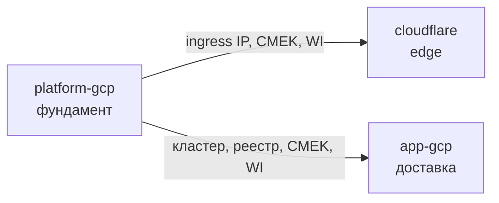
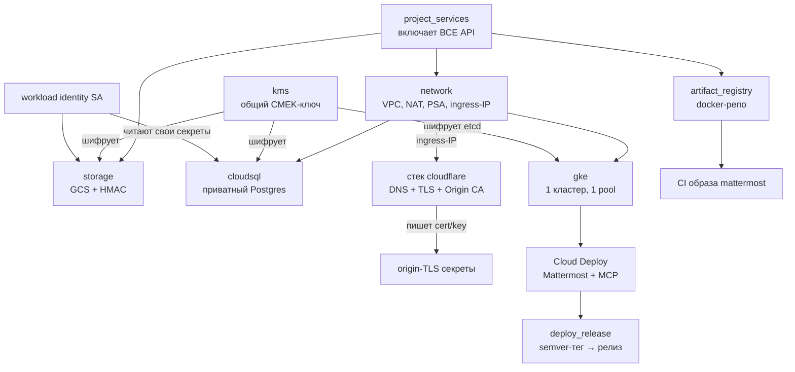

# YourOwn.Chat

Self-hosted чат-платформа Mattermost в Google Cloud за Cloudflare, целиком
описанная в **HCP Terraform Stacks** — production-практики в бюджете около ~$100/мес.

**[English version → README.md](README.md)**

> Русская версия — обзорная: архитектура, решения и повседневные сценарии.
> Пошаговый бутстрап с командами (единый источник истины) — в
> [английском README](README.md#google-cloud-initial-setup).

---

## Что внутри

Всё живёт в одном GCP-проекте и описано **тремя связанными (linked) Terraform
Stacks** — у каждого свой стейт и свой blast radius:

| Стек | Директория | Владеет | Меняется |
|---|---|---|---|
| **platform-gcp** | `terraform/platform-gcp` | Stateful-фундамент: API, сеть + статический ingress-IP, CMEK-ключ, GKE-кластер, Cloud SQL, хранилище, реестр образов, Workload Identity SA | Редко |
| **cloudflare** | `terraform/cloudflare` | Публичный edge `yourown.chat`: DNS, TLS/security-настройки, DNSSEC, WAF, Origin CA cert + origin-TLS секреты | Иногда |
| **app-gcp** | `terraform/app-gcp` | Секреты, отдельные пайплайны Mattermost и MCP, постоянный dev PostgreSQL, CI образа, роутинг тегов и бутстрап кластера | Часто |

Платформенный стек **публикует** ключевые значения (ingress-IP, ID кластера,
координаты реестра, CMEK-ключ, WI-члены); два других **потребляют** их через
механизм linked stacks. Ничего не копируется руками, а когда apply платформы
меняет опубликованное значение — HCP сам запускает планы даунстримов:



Зачем резать? Ошибка в edge-правилах или CI теперь физически не может задеть
стейт, в котором лежат VPC, кластер и база. А Cloudflare-токен (единственный
статический секрет во всей системе) живёт в собственном стеке.

### Возможности

| Возможность | Как |
|---|---|
| PostgreSQL | Cloud SQL, только private IP, Франкфурт (`europe-west3`), PITR + бэкапы 7 дней |
| Объектное хранилище | GCS-бакет + S3-совместимые HMAC-ключи для Mattermost |
| Kubernetes | Один зональный GKE Standard, приватные ноды, один autoscaling pool `general` (`e2-standard-2`, 1–3 ноды) |
| Реестр образов | Один Artifact Registry (`docker`), опциональное сканирование уязвимостей |
| CI | Cloud Build собирает образ Mattermost по git-тегу `v*-patched` |
| CD | Отдельные Mattermost и MCP пайплайны; временные тестовые поды; единый semver-тег запускает только изменённые компоненты |
| Секреты | Всё в Secret Manager, монтируется через CSI-аддон + Workload Identity |
| Шифрование | Один общий Cloud KMS **HSM**-ключ (CMEK, ротация 90 дней) на Cloud SQL, GCS, Secret Manager и **etcd GKE** (application-layer шифрование Kubernetes Secrets) |
| Edge | Cloudflare-прокси: Full (Strict) TLS, DNSSEC, HSTS, редирект www→apex, Origin CA cert из Terraform |

> В GCP нет «S3» — эквивалент это Cloud Storage (GCS) бакет, он и создаётся, в
> том же немецком регионе.

---

## Как всё связано



Поток простыми словами:

1. **platform-gcp** строит фундамент и резервирует статический публичный IP.
2. **cloudflare** направляет `yourown.chat` на этот IP (через прокси),
   ужесточает edge, выпускает Origin CA сертификат и пишет его прямо в Secret
   Manager. Приватный ключ не покидает этот стек — linked stacks не публикуют
   sensitive-значения, поэтому секреты создаются там, где рождается серт.
3. **app-gcp** подключает доставку: Cloud Build следит за тегами в
   `pilprod/mattermost` и после успешной сборки запускает Mattermost pipeline.
   Semver-тег на **этом** репо сравнивается с предыдущим и направляет изменения
   Mattermost и/или MCP в независимые пайплайны.
   Он же бутстрапит сам кластер — Mattermost Operator и закрытый на Cloudflare
   ingress-nginx ставятся как Terraform-managed Helm-релизы (helm-провайдер
   ходит на endpoint GKE с короткоживущим токеном того же keyless apply SA;
   `loadBalancerIP` приезжает из опубликованного платформой ingress IP).
4. Kubernetes-workloads (`helm/`) читают свои креды из Secret Manager в
   рантайме — подам всё равно, какой стек положил значение.

---

## Структура репозитория

```
terraform/
  platform-gcp/          # стек 1: фундамент (сеть, GKE, SQL, storage, KMS, реестр, WI)
  cloudflare/            # стек 2: edge (DNS/TLS/WAF/Origin CA) + origin-TLS секреты
  app-gcp/               # стек 3: доставка (секреты, Cloud Deploy, CI, релизы,
                         #   бутстрап кластера: operator + ingress-nginx Helm-релизы)
                         # в каждом: *.tfcomponent.hcl + *.tfdeploy.hcl + modules/ + свой lock
helm/                    # Kubernetes-workloads, доставляются Cloud Deploy
  skaffold.yaml          # профили рендера dev/prod
  mattermost/            # prod Mattermost (operator CR + SecretProviderClass)
  matterbridge/          # изолированный деплой моста
  mattermost/            # единый chart Mattermost с values для dev и prod
  mcp/                   # chart MCP, smoke-тесты и cleanup
  ingress-nginx/         # values только-для-Cloudflare + ранбук
docs/BUILD.md            # процесс сборки образа подробно
```

Важные структурные детали:

- **Один стек = одна директория.** HCP читает по стеку на working directory —
  три HCP-стека смотрят на три директории.
- **Модули не шарятся между стеками.** Бандлер Stacks не ходит по `../`,
  поэтому у каждого стека свои `modules/` (маленький `secrets`-модуль
  существует дважды сознательно).
- **У каждого стека свой lock** (`.terraform.lock.hcl`) и пин версии
  Terraform (`.terraform-version`, сейчас 1.15.8).

### Конвенция имён

Ресурсы называются по **фактическому охвату и функции** — никогда по проекту
(он и так `yourown-chat`) и никогда по типу ресурса:

| Охват | Правило | Примеры |
|---|---|---|
| Глобальные синглтоны | голая роль | `vpc`, `cmek`, `psa`, `allow-internal` |
| Региональные синглтоны | регион | subnet/router/NAT = `europe-west3` |
| Зональные | зона | GKE-кластер `europe-west3-b` |
| Принадлежащие workload'у | функциональный префикс | SQL `mattermost-europe-west3-b`, бакет `mattermost-europe-west3`, HMAC SA `mattermost-storage` |
| Платформенная утварь | роль, затем охват | `releaser-europe-west3`, `clouddeploy-europe-west3`, `deploy-source-europe-west3`, `ingress-europe-west3` |
| Ролевые SA | роль | `mattermost`, `matterbridge` |

Деплои стеков: у GCP-стеков деплой `eu` (регион и есть единица деплоя), у
cloudflare — `yourown-chat` (зона глобальна, единица деплоя — домен).

---

## Развёртывание

Единственная ручная фаза — бутстрап; дальше всё делает `terraform apply`.
Полная пошаговая инструкция с командами — в
[английском README](README.md#google-cloud-initial-setup). Кратко:

1. **Бутстрап GCP** (один раз): шесть bootstrap-API, Workload Identity
   pool/provider для HCP Terraform, SA `terraform-plan` / `terraform-apply` с
   ролями. Ключей нет — авторизация keyless OIDC насквозь.
2. **Авторизовать GitHub-подключение Cloud Build** (один раз, в консоли):
   одно OAuth-подключение `pilprod-github` на оба репо.
3. **Создать Cloudflare API-токен** (единственный статический секрет) и
   положить в HCP variable set, привязанный к стеку cloudflare. Помимо zone
   permissions, Zero Trust требует account-level `Cloudflare Tunnel: Edit`,
   `Access: Apps and Policies: Edit` и `Access: Organizations, Identity
   Providers, and Groups: Edit`. Последнее право необходимо для чтения и
   переименования team/domain; без него plan падает с `failed to read Access
   Organization state`.
4. **Создать три HCP-стека** — имена строго `platform-gcp`, `cloudflare`,
   `app-gcp` (на них ссылаются linked-источники), working directory
   `terraform/<стек>`.
5. **Apply**: сначала platform-gcp; cloudflare и app-gcp подтянутся сами (оба
   зависят только от платформы, их порядок неважен).
6. **Выкатить workloads** из [`helm/`](docs/DEPLOY.md): ingress-nginx +
   оператор Mattermost, применить манифесты. Бакет и WI-емейлы приезжают сами
   через Cloud Deploy deploy parameters; руками остаются только ingress
   `loadBalancerIP` и RBAC-принципал dev-команды.

### Повседневные сценарии

**Выпустить новый образ Mattermost** — тег на репо исходников; артефакт
промоутится, а не пересобирается:

```
git tag v9.11.3-patched  (на pilprod/mattermost)
  → Cloud Build собирает и пушит docker/mattermost:v9.11.3-patched
```

**Нарезать релиз** — тег на этом репо; никто не запускает gcloud руками:

```
git tag 1.2.3  (на pilprod/yourown-chat)
  → Cloud Build триггер "release" запускает gcloud deploy releases create
  → dev-таргет деплоится + smoke-тест verify
  → промоушен в prod ждёт апрува
  → после апрува dev масштабируется в ноль и начинается prod rollout
```

**Ротировать пароль БД** — бампни одно закоммиченное значение, без
внезапных time-based ротаций:

```
правка terraform/platform-gcp/platform.tfdeploy.hcl:
  cloudsql_password_rotation = "2026-07-13"   # любое новое значение
merge + apply  → новый пароль, SQL-юзер и оба секрета обновлены разом
kubectl rollout restart -n mattermost deploy  → поды подхватят секрет
```

Подробности: [`docs/BUILD.md`](docs/BUILD.md).

---

## Решения и компромиссы

### Один кластер, ~$100/мес

Требование — production-практики **и** самый дешёвый практичный GKE около
~$100/мес. Free tier GKE прощает плату за управление ровно одному зональному
кластеру — второй добавил бы ~$74/мес. Поэтому dev и prod делят **один
кластер и один node pool**:

- один on-demand pool `general` (`e2-standard-2`), autoscaling от одной до трёх нод;
- production PriorityClass может вытеснить временные dev-workloads; requests,
  ResourceQuota и LimitRange ограничивают потребление dev;
- после smoke dev Mattermost/MCP остаются доступны ревьюеру; после апрува
  predeploy масштабирует их в ноль и запускает prod rollout, а временная
  rollout-нода автоматически удаляется Cluster Autoscaler;
- dev-сервисы и базы находятся в общем namespace `dev`, который заперт
  namespace-scoped RBAC и default-deny NetworkPolicies; интеграционные
  workloads, включая Matterbridge, остаются в отдельных namespace.

| Статья | Конфиг | ≈$/мес |
|---|---|---|
| Управление GKE | 1 зональный кластер | $0 (free tier) |
| Общие ноды | 1× `e2-standard-2` постоянно | ≈$49 |
| Запас rollout | временные autoscaled-ноды | обычно <$1–2 |
| Cloud SQL | `db-f1-micro`, 20 GiB, PITR | ≈$12–15 |
| GCS + PVC | мелочь | ≈$3 |
| Буфер | egress/рост | ≈$10–15 |
| **Итого** | | **≈$75–85** |

Каждая ручка имеет путь ужесточения — переменная, а не переделка:
`gke_regional = true` для HA control plane, `REGIONAL` для HA Cloud SQL,
отдельный deployment для жёсткого разделения dev/prod.

### Что не урезано даже в этом бюджете

Приватные ноды + Cloud NAT, Workload Identity везде, Shielded Nodes, Cloud SQL
только по private IP с принудительным TLS, uniform bucket access + запрет
публичного доступа, отдельные least-privilege SA под каждую роль, все секреты
в Secret Manager, CMEK (HSM, FIPS 140-2 L3) включён по умолчанию.

### Спорные решения — обоснование

1. **Франкфурт (`europe-west3`), не Берлин** — дешевле и зрелее. Меняется
   одной переменной.
2. **GKE Standard, не Autopilot** — нужны явные пулы, taints и контроль типа
   машин, которые Autopilot прячет.
3. **Реестр в platform-gcp, не в app-gcp** — это stateful-хранилище
   выпущенных образов; потеря осиротит все промоутнутые теги. CI дотягивается
   через стек-линк, цикла зависимостей нет.
4. **HSM CMEK (~$1/мес), не SOFTWARE (~$0.06/мес)** — Cloud SQL привязывает
   ключ при создании; HSM сразу избавляет от миграции инстанса потом.
5. **Только существующий проект** — бутстрап org/folder/project отложен в
   будущий foundation-стек.
6. **OAuth-подключение Cloud Build из консоли, не PAT** — PAT-путь хрупкий
   (токен должен сам видеть установку GitHub App); разовая авторизация в
   консоли — надёжный, благословлённый Google путь.

### Грабли, на которых уже постояли (закодировано в конфиге)

- **Linked stacks не публикуют sensitive-значения** — поэтому origin-TLS
  секреты создаёт стек cloudflare, а не передаёт их в app-gcp.
- **Varset — только для секретов.** Всякое `store`-значение в Stacks
  эфемерно: для Cloudflare-токена идеально, для чего-либо попадающего в план —
  отказ. Операционные тумблеры — литералы в `*.tfdeploy.hcl`.
- **Объекты Cloud KMS неудаляемы** — повторный бутстрап существующего проекта
  требует `kms_adopt_existing = true` (config-driven import, дальше no-op).
- **Cloud SQL резервирует имя удалённого инстанса ~неделю** — отсюда
  `cloudsql_adopt_existing_instance` и зонально-честные имена.
- **Cloudflare нормализует `tls_1_3` в `zrt` при включённом 0-RTT** —
  отправка `"on"` даёт вечный diff в плане. В конфиге — `zrt`.
- **Не вешай IP-фильтр на Cloudflare-токен при ранах на HCP** — egress-IP
  планов/эпплаев динамические и не входят в публикуемые HCP диапазоны.

---

## Модель безопасности

- **Identity**: keyless OIDC → Workload Identity Federation для Terraform;
  Workload Identity у каждого пода; отдельные SA под роль; дефолтный compute
  SA не используется никогда.
- **Сеть**: приватные ноды, egress только через Cloud NAT, Cloud SQL по
  private IP через Private Service Access, ingress-nginx пускает только
  диапазоны Cloudflare.
- **Секреты**: всё в Secret Manager, реплики под CMEK, чтение в рантайме через
  CSI-аддон, доступ по-тенантно (`secretAccessor` ровно на свои секреты).
- **Edge**: Full (Strict) TLS с Origin CA сертом из Terraform, DNSSEC, HSTS с
  preload, опциональные Authenticated Origin Pulls (mTLS).
- **Dev-окружение**: один namespace для сервисов и баз, namespace RBAC (без
  кластерных прав), default-deny для межnamespace-трафика,
  `automountServiceAccountToken: false`.

## Куда расти

Модули намеренно маленькие: Vault, Authentik, cert-manager, ExternalDNS или
мониторинг встают новыми компонентами, новые сервисы — Workload
Identity-тенантами, новые образы — ещё одной записью в `builds`. Рост бюджета
превращается в жёсткое разделение dev/prod (ещё один deployment или второй
кластер) без переписываний.
