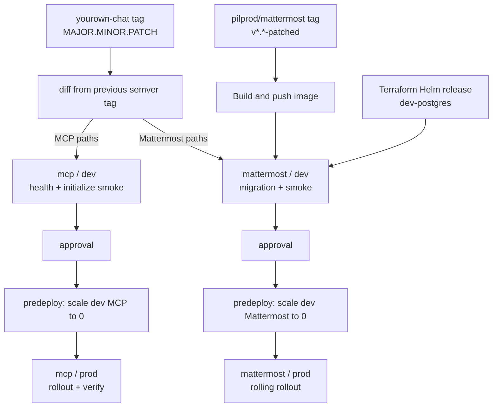

# Deploying workloads

Terraform owns the delivery rails and long-lived dependencies. Cloud Deploy
owns only application rollouts. This separation prevents an unchanged database
or unrelated component from being reapplied during every release.

## Release topology



There are two Cloud Deploy pipelines:

| Pipeline | Automatic stage | Review gate | After approval |
|---|---|---|---|
| `mattermost` | `mattermost-dev`; exercises migrations against persistent `dev-postgres` | verified dev stays running for reviewer checks | predeploy scales dev to zero, then the operator performs a rolling rollout |
| `mcp` | `mcp-dev`; creates `dev-mcp-*` deployments and runs protocol smoke tests | verified dev stays running for reviewer checks | predeploy scales dev to zero, then MCP prod deploys and verifies |

The Mattermost reviewer opens `https://dev.yourown.chat`. Cloudflare Access
admits only the configured reviewer emails, then the outbound-only Tunnel
routes the request to `dev-mattermost.dev.svc.cluster.local:8065`. There is no
public dev LoadBalancer or origin address. The hostname remains available from
successful verification until the reviewer approves production; that approval
starts the cleanup predeploy action.

Cleanup does not run as a Kubernetes Job. Cloud Deploy starts a Skaffold
custom-action container with no `executionMode.kubernetesCluster`, so it runs
in the Cloud Build execution environment under a dedicated
`cleanup-mattermost` or `cleanup-mcp` Google service account. Each identity can
read cluster metadata and is bound inside Kubernetes only to `get`, `patch`,
and `update` its exact disposable Deployment names. There is no cleanup
ServiceAccount, API-egress NetworkPolicy, or idle cleanup pod in GKE.

`dev-postgres` consists of Terraform-managed Kubernetes resources. Its PVC
survives application releases and provides a continuous migration history. The
current development database may be imported or replaced during the first
Terraform apply; it contains no important data.

## What starts a release

### A patched Mattermost source tag

Pushing `v*.*-patched` in `pilprod/mattermost` starts the image build. Only
after the image is successfully pushed does that build clone `yourown-chat`
`main` and create a release in the `mattermost` pipeline. Both stages receive
the same image tag; the image digest is recorded in release annotations.

```bash
git tag v9.11.3-patched
git push origin v9.11.3-patched
```

This path needs no second tag in `yourown-chat`.

### A unified platform tag

Pushing a `MAJOR.MINOR.PATCH` tag in this repository starts one router. It
compares the tagged commit with the previous semver platform tag:

- `helm/mattermost/` or `helm/matterbridge/` creates a
  `mattermost` release;
- `helm/mcp/` creates an `mcp` release when `mcp_servers_enabled=true`;
- `helm/skaffold.yaml` creates both releases;
- unrelated changes create no Cloud Deploy release.

For a routed Mattermost release, the trigger resolves the newest
`v*-patched` tag in Artifact Registry and passes it to both stages. A later
platform release therefore cannot accidentally restore the static chart
default after a direct image-triggered rollout.

```bash
git tag 1.2.3
git push origin 1.2.3
```

Component tags are intentionally not used. A platform version identifies one
reviewed repository state while the router avoids rolling unchanged workloads.

## Mattermost guarantees

The dev stage deploys one Mattermost instance and waits for
`/api/v4/system/ping`. Application startup therefore has to complete any
database migrations before verification succeeds. Dev stays running for
review; after production approval, the prod rollout's predeploy action scales
dev Mattermost to zero, leaving PostgreSQL running.

Production has one replica and must not delete the old pod first. The
Mattermost operator's rolling behavior starts the replacement and waits for it
to become Ready before retiring the old instance. Do not change the production
strategy to `Recreate`; confirm the generated rollout before approving a
version that changes the operator or CR schema.

Approve from Cloud Deploy, or:

```bash
gcloud deploy releases promote \
  --release=RELEASE \
  --delivery-pipeline=mattermost \
  --region=europe-west3
```

Rollback:

```bash
gcloud deploy targets rollback mattermost-prod \
  --delivery-pipeline=mattermost \
  --region=europe-west3
```

## MCP verification

The dev stage deploys prefixed instances in the existing credential
namespaces. It exposes no dev ingress and checks:

- all health endpoints;
- MCP `initialize` for Terraform and Google Cloud;
- the expected unauthenticated `401` from Google Workspace OAuth.

After smoke tests, the three dev deployments remain available for review.
Production approval runs their external cleanup hook as the prod predeploy
step, then production deploys and repeats verification.

```bash
gcloud deploy releases promote \
  --release=RELEASE \
  --delivery-pipeline=mcp \
  --region=europe-west3
```

## Manual release fallback

`helm/cloudbuild.yaml` creates one release. Choose the component explicitly:

```bash
gcloud builds submit \
  --config=helm/cloudbuild.yaml \
  --substitutions=_PIPELINE=mattermost .

gcloud builds submit \
  --config=helm/cloudbuild.yaml \
  --substitutions=_PIPELINE=mcp .
```

Direct Kubernetes application is only a debugging fallback because it bypasses
Cloud Deploy parameters, verification, cleanup, approval, and release history.

## One-time apply and migration

Apply `platform-gcp`, `cloudflare`, then `app-gcp`. The app stack:

- creates namespaces and Secrets;
- owns the persistent `dev-postgres` Service and StatefulSet directly;
- creates the `mattermost` and `mcp` pipelines, their least-privilege execution
  identities, and dedicated external predeploy cleanup identities;
- creates the unified platform-tag trigger and Mattermost image trigger.

The platform now has one shared `general` pool using `e2-standard-2`
(`min=1`, `max=3`).
Production MCP uses the `production` PriorityClass, operator-generated
Mattermost and platform pods inherit `platform-default`, and all disposable dev
workloads explicitly use `development` (negative priority). The `dev` namespace
also has a ResourceQuota and LimitRange. Cluster Autoscaler can therefore add a
temporary node for a rollout and remove it again without keeping a mostly idle
dev VM.

The old database objects were previously applied by Cloud Deploy and are not
in Terraform state. Before the first apply of this change, remove only their
controllers. The generated PVC normally remains; deleting it too is acceptable
here because the current dev database contains no important data:

```bash
kubectl -n dev delete statefulset dev-postgres
kubectl -n dev delete service dev-postgres
# Optional clean start:
kubectl -n dev delete pvc data-dev-postgres-0
```

Do this before applying `platform-gcp`, because that apply removes the old dev
node pool and automatically queues the linked app stack. Then apply
`platform-gcp`; the following `app-gcp` run recreates PostgreSQL on the shared
pool and owns it from then on.

Before the first release, verify:

```bash
kubectl -n dev get statefulset,pod,pvc -l app=dev-postgres
gcloud deploy delivery-pipelines list --region=europe-west3
```

See [BUILD.md](BUILD.md) for image CI and [MCP.md](MCP.md) for credentials,
networking, and manual MCP diagnostics.
